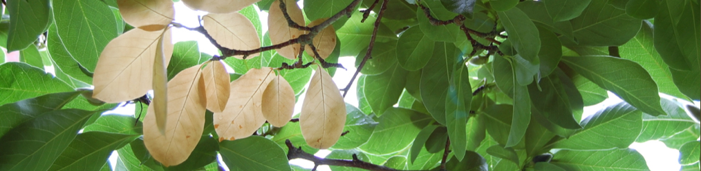

# BI163 The Cellular Basis of Life 

**Colby College  -  Fall 2022  -  Section C  -  Syllabus**

#### Meeting times

Mondays, Wednesdays and Fridays 11-11:50 am, [Olin 001](https://map.colby.edu/)

#### Instructor

[Dr. David R. Angelini](https://www.colby.edu/directory/profile/dave.angelini/) 

e-mail: [dave.angelini@colby.edu](mailto:dave.angelini@colby.edu)

Office hours: Mondays 12-1pm, Tuesdays 4-5pm, Wednesdays 8-9am

#### Learning Assistants

- Olivia Petrini-Poli
- Michelle Bechtel
- Jamie Page

### Course Description

This course conducts an examination of cells as the fundamental unit of life. Aspects of evolutionary biology, cell biology, molecular biology, and genetics are reviewed. A major objective is the development of intellectual tools to ask and answer interesting biological questions. The laboratory will allow each student to design and conduct experiments, to analyze and present data, and practice writing in the scientific format. BI163 is the first half of a year-long series introducing the fundamental concept of biology. 

A student successfully completing this course will demonstrate an understanding of: 

1. the cell as the fundamental structural unit of all living organisms, and 

2. the diversity of life, especially as it relates to cellular processes

#### Required textbook

*Biological Science*, Scott Freeman, et al., 6th edition. <a href="https://www.amazon.com/Biological-Science-6th-Scott-Freeman/dp/0321976495/" target="_blank">[Amazon]</a> <a href="https://www.powells.com/book/biological-science-9780321976499" target="_blank">[Powells]</a>

You should read the assigned chapters or pages before or immediately after the corresponding class period. Students are encouraged to purchase used copies of the textbook. Any additional readings will be provided via Moodle.

### Laboratory

The lab will give you hands-on experience exploring the principles of biology discussed in class. You will learn about the practical aspects of the way that scientists do biology: experimental techniques, proper use of equipment, methods of data analysis, and abundant scientific writing. These concepts serve as a foundation for more advanced courses in the biology major. All aspects of laboratory (communication, assignments, instruction) will be managed by your lab instructor.

Unexcused absence from the laboratory will result in your being dropped from the course. Please attend the laboratory section assigned to you. Only in the case of a family or medical emergency can you switch to a different laboratory section in a given week, and only with the permission of both lab instructors. Extracurricular activities that conflict with regularly scheduled academic classes are not considered to be emergencies. 

### Grades

Your grade for BI163 will be based on the lecture (75%) and laboratory (25%) sections of the course. The specifics of your laboratory grade, and a lab syllabus, will be provided by your lab instructor.

Assignments are not accepted late, except in the case of a valid, compelling and documented justification.

No individual extra credit assignments will be offered. 

#### Lecture grades

| component                    | percent of course grade |
|:---------------------------- |:-----------------------:|
| Exam 1                       | 17%                     |
| Exam 2                       | 22%                     |
| Exam 3 (final)               | 26%                     |
| graded assignments / quizzes | 10%                     |

#### Final course grades

| point range | grade assigned                                               |
|:----------- |:------------------------------------------------------------ |
| > 90%       | A (most likely <93 A-, >93 A, A+ for exceptional performance) |
| 80-90%      | B (most likely <83 B-, 83-87 B, >87 B+)                      |
| 70-80%      | C (most likely <73 C-, 73-77 C, >77 C+)                      |
| 60-70%      | D (most likely <63 D-, 63-67 D, >67 D+)                      |
| < 60%       | F                                                            |

### Class attendance

Your active engagement with the course will be important to success. Therefore attendance at all class meetings is expected, except in exceptional circumstances. Isolated absences that do not result in late assignments are not a serious issue. Attending a different section of BI163 is not an acceptable way to make up for a missed class. (The other sections may be discussing a completely different topic on any day.) Poor attendance may result in an academic warning and may negatively affect your course grade, at the instructor’s discretion. Be aware that classes cannot be missed for an athletic practice. However, if your request is made in advance, I generally allow absences for an athletic competition. 

### Web content & E-mail

Moodle ( http://moodle.colby.edu/ ) will be the primary electronic method of contact for this course. Announcements and material related to the course will be posted there frequently, so please check the site on a regular basis. On the site you will also find the course syllabus and the schedule of topics, assignments, and PDF files from lecture slides.

### Exams
There will be three lecture-based exams during the semester, including two mid-term exams and one final comprehensive (cumulative) exam covering the whole semester. These exams will be closed-book, closed-note, individual-effort exams. Leave all electronic devices out of the room. Exams will take place on the following days (note the evening times of the first two): 

| exam       | date                        | time  | location |
|:---------- |:--------------------------- |:----- |:-------- |
| Exam 1     | **TBD**: week of October 3  | 7-9pm | TBD      |
| Exam 2     | **TBD**: week of November 7 | 7-9pm | TBD      |
| Final Exam | **TBD**: December 14-19     | TBD   | TBD      |

### Accommodations for public health

Cooperation with the [college’s plan for pandemic response](https://covid19.colby.edu/covid-19-health-and-safety/) is expected. Specific impacts to BI163 include:

- If you test positive for SARS-CoV-2 or experience [symptoms of covid-19](https://www.cdc.gov/coronavirus/2019-ncov/symptoms-testing/symptoms.html), including fever or chills, cough, fatigue and headache, please do not attend class in person.
- Masking is optional, but strongly encouraged. I encourage everyone to mask while listening. While lecturing, I will not mask unless I show symptoms of flu or covid. Students are welcome to unmask to speak to one another or to the class. But exercise good judgement: Mask after recent travel, if you experience symptoms, or if you perceive symptoms in others nearby.
- In the case of a covid case surge, it may become necessary for the course to transition to a Zoom format. In which case, changes to the syllabus may be necessary.
- Office hours may be held on Zoom. Hours may need to be modified.
- This policy may be modified as conditions change.

### Academic support

If you experience difficulty in this course for any reason, a wide range of services are available from the College to support you.

- First, please speak with me early if you are having trouble in the course. 
- The [Office of the Dean of Students](http://www.colby.edu/administration_cs/student-affairs/deanofstudents/studentconduct/offices_services/dos/) offers services for students with learning differences. If you suspect you have a learning difference that might require accommodations in this course, please inquire with the Dean of Students Office.
- The [Farnham Writing Center](http://web.colby.edu/farnham-writerscenter/) offers support for students on basic writing and reading skills.
- [Counseling Services](http://www.colby.edu/counseling/) (x4460) provided from the Health Center offer professional, confidential consultations regarding family problems, stress, depression, cultural adjustments, concerns with sexuality, alcohol and drug use, trauma and other personal issues.

### Academic honesty 

Honesty, integrity, and personal responsibility are cornerstones of a Colby education and provide the foundation for scholarly inquiry, intellectual discourse, and an open and welcoming campus community. These values are articulated in the Colby Affirmation and are central to this course. Students are expected to demonstrate academic honesty in all aspects of this course. Academic dishonesty includes, but is not limited to: plagiarism (which includes paraphrasing from sources, even with a citation); claiming another’s work or a modification of another’s work as one’s own; buying or attempting to buy papers or other assignments; fabricating information or citations; knowingly assisting others in acts of academic dishonesty; violating clearly stated rules for taking an exam; misrepresentations to faculty within the context of a course; and submitting the same work, including an essay that you wrote, in more than one course. Sanctions for academic dishonesty are assigned by an academic review board and may include failure on the assignment, failure in the course, or suspension or expulsion from the College.

For more information on recognizing and avoiding plagiarism, see these guides:
- [Avoiding Plagiarism](http://libguides.colby.edu/avoidingplagiarism)
- [Academic Honesty](http://web.colby.edu/farnham-writerscenter/academic-honesty/)

### Sustainability 

Environmental degradation is a serious biological and societal issue. [Colby](http://www.colby.edu/administration_cs/green/) is committed to practices that promote sustainable living. To help minimize the environmental impact of this course, I encourage you to buy used books. Minimize paper use by reading slides on a device when possible, rather than printing copies. It is acceptable to take notes on a laptop or tablet during class. If you choose to print, please print double-sided on recycled paper. Multiple slides may be printed to a single sheet. Recycle unnecessary paper after the end of the semester. 

### Tentative Course Schedule

| week of     | topic               | Freeman chapter | notes                            |
| :---------- | :------------------ | :-------------- | :------------------------------- |
| Sept 7      | Cell theory         | 1; BioSkills 13 |                                  |
| Sept 12     | Lipids              | 2; 6            |                                  |
| Sept 19     | Proteins            | 3               |                                  |
| Sept 26     | Enzymes             | 8               |                                  |
| Oct 3       | Cell structure      | 7               | Exam 1, details TBD              |
| Oct 10      | Cellular repiration | 9               |                                  |
| Oct 17      | Photosynthesis      | 10              | Fall Break, no class Oct 17      |
| Oct 24      | Nucleic Acids       | 4               |                                  |
| Oct 31      | Cell division       | 12              |                                  |
| Nov 7       | DNA replication     | 15              | Exam 2, details TBD              |
| Nov 14      | DNA repair          | 15              |                                  |
| Nov 21      | Transcription       | 16              | Thanksgiving, no class Nov 23-25 |
| Nov 28      | Translation         | 17              |                                  |
| Dec 5       | Microbiota          | 26              |                                  |
| final exams |                     |                 | Exam 3, details TBD              |
