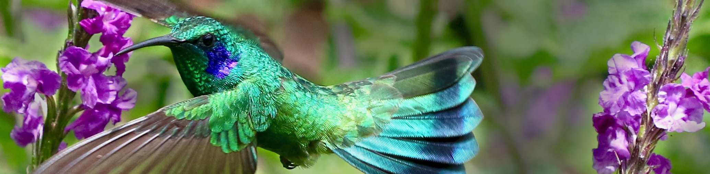

# BI164 Evolution & Diversity

**Colby College  -  Spring 2023  -  Section C  -  Syllabus**

#### Meeting times

Mondays, Wednesdays and Fridays 11-11:50 am, [Olin 001](https://map.colby.edu/)

#### Instructor

[Dr. David R. Angelini](https://www.colby.edu/directory/profile/dave.angelini/) 

e-mail: [dave.angelini@colby.edu](mailto:dave.angelini@colby.edu)

Office hours: Mondays 12-1pm and Tuesdays 10am-12pm, or by appointment

#### Learning Assistants

- [Grace Meikle](gsmeik22@colby.edu)
- [Jackie Ortiz Lopez](jortiz25@colby.edu)
- [Paige Bolyard](plboly25@colby.edu)

### Course Description

Biological diversity supports the existence of life itself. It is also a source of genuine wonder. In this course, we will introduce the study of biological diversity at multiple scales. We will examine how patterns of inheritance arise from its molecular and cellular nature. You will learn why and how evolution occurs in populations and across eons of time to generate the amazing diversity of life. We will explore this diversity in major lineages of organisms, and examine how organisms interact. What you learn in this course will be foundational for further the study of biology and related subjects. 

### Course Objectives

1. Understand the philosophy of science and scientific methodologies as they are applied in biology
2. Understand the general principles of evolutionary biology, including heritability, genetic and phenotypic variability and how they change over time, speciation and species interactions.
3. Build foundational knowledge of biological diversity at multiple levels of organization
4. Develop skills in laboratory techniques, data analysis, and scientific writing

#### Required textbook

*Biological Science*, Scott Freeman, et al., 6th edition. <a href="https://www.amazon.com/Biological-Science-6th-Scott-Freeman/dp/0321976495/" target="_blank">[Amazon]</a> <a href="https://www.powells.com/book/biological-science-9780321976499" target="_blank">[Powells]</a>

You should complete the assigned readings before each class. Reading in advance will allow you to engage in that day's activities. Students are encouraged to purchase used copies of the textbook. Any additional readings will be provided via Moodle.

### Laboratory

The lab will give you hands-on experience exploring the principles of biology discussed in class. You will learn about the practical aspects of the way that scientists do biology: experimental techniques, proper use of equipment, methods of data analysis, and abundant scientific writing. These concepts serve as a foundation for more advanced courses in the biology major. All aspects of laboratory (communication, assignments, instruction) will be managed by your lab instructor.

Unexcused absence from the laboratory will result in your being dropped from the course. Please attend the laboratory section assigned to you. Only in the case of a family or medical emergency can you switch to a different laboratory section in a given week, and only with the permission of both lab instructors. Extracurricular activities that conflict with regularly scheduled academic classes are not considered to be emergencies. 

### Grades

Your grade for BI164 will be based on the lecture and laboratory sections of the course. The specifics of your laboratory grade, and a lab syllabus, will be provided by your lab instructor.

Assignments are not accepted late, except in the case of a valid, compelling and documented justification.

No individual extra credit assignments will be offered. 

#### Lecture grades

| component                           | points |
| :---------------------------------- | :----: |
| Lab                                 |  250   |
| Quizzes                             |  100   |
| Assignments and class participation |  130   |
| Midterm exams (3, 130 pts each)     |  390   |
| Final exam                          |  130   |
| **total**                          | 1,000  |

#### Final course grades

| point range | grade assigned                                               |
| :---------- | :----------------------------------------------------------- |
| > 900       | A (most likely <930 A-, >930 A, A+ for exceptional performance) |
| 800-900     | B (most likely <830 B-, 830-870 B, >870 B+)                  |
| 700-800     | C (most likely <730 C-, 730-770 C, >770 C+)                  |
| 600-700     | D (most likely <630 D-, 630-670 D, >670 D+)                  |
| < 600       | F                                                            |

### Class attendance

Your active engagement with the course will be important to success. Therefore attendance at all class meetings is expected, except in exceptional circumstances. If you are aware that you will miss class for any reason, please discuss this with me in advance. Isolated absences that do not result in late assignments are not a serious issue.  Be aware that classes cannot be missed for an athletic practice. However, if your request is made in advance, I typically allow absences for athletic competition. Unexcused absences will negatively effect participation scores. Attending a different section of BI164 is not an acceptable way to make up for a missed class. (The other sections may be discussing a completely different topic on any day.) Poor attendance will result in an academic warning.

### Web content & E-mail

Moodle ( http://moodle.colby.edu/ ) will be the primary electronic method of contact for this course. Announcements and material related to the course will be posted there frequently, so please check the site on a regular basis. On the site you will also find the course syllabus and the schedule of topics, assignments, and PDF files from lecture slides.

### Exams
There will be three midterm exams during the semester, and one comprehensive (cumulative) final exam covering the whole semester. Midterm exams will be closed-book, closed-note, individual-effort exams.

| exam       | date                 | time        | location |
| :--------- | :------------------- | :---------- | :------- |
| Midterm 1  | Tuesday, February 21 | 6:00-7:30pm | Olin 001 |
| Midterm 2  | Wednesday, March 15  | 6:00-7:30pm | Olin 001 |
| Midterm 3  | Thursday, April 13   | 6:00-7:30pm | Olin 001 |
| Final Exam | **TBD**: finals week | TBD         | TBD      |

### Accommodations for public health

Cooperation with the [college’s plan for pandemic response](https://covid19.colby.edu/covid-19-health-and-safety/) is expected. Specific impacts to BI164 include:

- If you test positive for SARS-CoV-2 or experience [symptoms of covid-19](https://www.cdc.gov/coronavirus/2019-ncov/symptoms-testing/symptoms.html), including fever or chills, cough, fatigue and headache, do not attend class in person. Report these results using the CoVerified app or [web interface](https://campus.coverified.us/login) or contact your advising dean.
- At certain times during the semester, you may be asked to wear a face mask in class. This mask should be an [N-95](https://www.cdc.gov/coronavirus/2019-ncov/prevent-getting-sick/types-of-masks.html) or similar design.
- In the case of a covid case surge in the community, it may become necessary for the course to transition to a Zoom format. In which case, changes to the syllabus may be necessary.
- Office hours may be held on Zoom. Hours may need to be modified.
- This policy may be modified as conditions change.

### Academic support

If you experience difficulty in this course for any reason, a wide range of services are available from the College to support you.

- First, please speak with me early if you are having trouble in the course. 
- The [Office of the Dean of Students](https://life.colby.edu/get-support/advising-academic-success/deans/) offers services for students with learning differences. If you suspect you have a learning difference that might require accommodations in this course, please inquire with the Dean of Students Office.
- The [Farnham Writing Center](http://web.colby.edu/farnham-writerscenter/) offers support for students on basic writing and reading skills.
- [Counseling Services](http://www.colby.edu/counseling/) (x4460) provided from the Health Center offer professional, confidential consultations regarding family problems, stress, depression, cultural adjustments, concerns with sexuality, alcohol and drug use, trauma and other personal issues.

### Academic Integrity

Honesty, integrity, and personal responsibility are cornerstones of a Colby education and provide the foundation for scholarly inquiry, intellectual discourse, and an open and welcoming campus community. These values are articulated in the Colby Affirmation and are central to this course. Students are expected to demonstrate academic honesty in all aspects of this course. Academic dishonesty includes, but is not limited to: plagiarism (which includes paraphrasing from sources, even with a citation); claiming another’s work or a modification of another’s work as one’s own; buying or attempting to buy papers or other assignments; fabricating information or citations; knowingly assisting others in acts of academic dishonesty; violating clearly stated rules for taking an exam; misrepresentations to faculty within the context of a course; and submitting the same work, including an essay that you wrote, in more than one course. Sanctions for academic dishonesty are assigned by an academic review board and may include failure on the assignment, failure in the course, or suspension or expulsion from the College.

For more information on recognizing and avoiding plagiarism, see these guides:
- [Avoiding Plagiarism](http://libguides.colby.edu/avoidingplagiarism)
- [Academic Integrity](https://www.colby.edu/academicintegrity/)

### Sustainability 

Environmental degradation is a serious biological and societal issue. [Colby](http://www.colby.edu/administration_cs/green/) is committed to practices that promote sustainable living. To help minimize the environmental impact of this course, I encourage you to buy used books. Minimize paper use by reading slides on a device when possible, rather than printing copies. It is acceptable to take notes on a laptop or tablet during class. If you choose to print, please print double-sided on recycled paper. Multiple slides may be printed to a single sheet. Recycle unnecessary paper after the end of the semester. 

### Tentative Course Schedule

| week of | topic | reading | notes |
|:--- |:--- |:--- |:--- |
| February 1 | Evolution & Diversity | Freeman Ch. 1.3-6 |  |
| February 6 | Heredity | 13.0-2; 14.0-5; 16.0-4 | No class on Feb. 6 |
| February 13 | Variation | 23.6, 51.2 |  |
| February 20 | Viruses & Prokaryotes | 33.1,3-4; 26.0-1,3-4 | Midterm 1 is Tuesday evening |
| February 27 | Microevolution | 23.0-2,4 |  |
| March 6 | Population genetics | 23.5 |  |
| March 13 | Protists & Fungi | 27.1,3-4; 29.1,3-4 | Midterm 2 is Wednesday evening |
| March 20 | **Spring Break** |  |  |
| March 27 | Phenotypic evolution | 22.0-5; 23.3 |  |
| April 3 | Macroevolution | 25.0-4; 21.5 |  |
| April 10 | Speciation | 24.0-3 | Midterm 3 is Thursday evening |
| April 17 | Ecology | 49.0-5; 52.0-4; 54.0-4 |  |
| April 24 | Plants | 28.1-3-4 |  |
| May 1 | Animals | 25.3; 30.1-2,4; 31.1-3; 32.1-4 |  |

