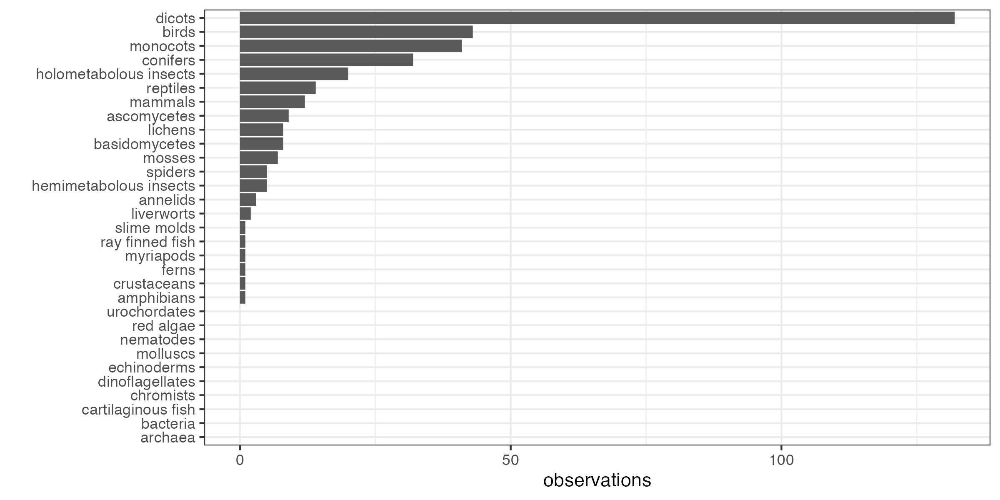
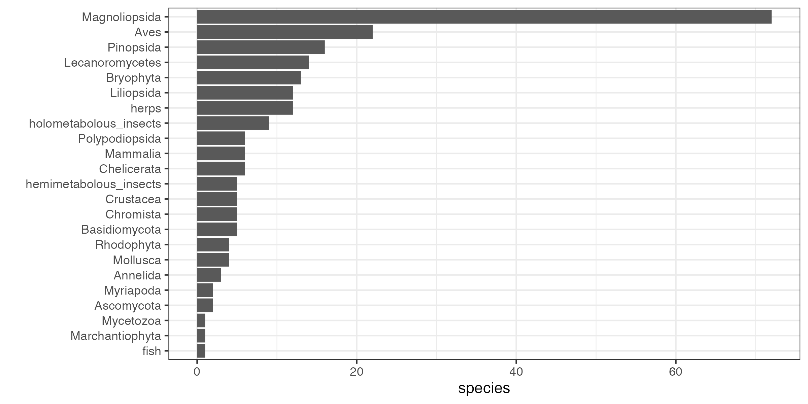

## Final Results!

The project ran from March 8 to May 9 and received 1,351 observations from 32 student-naturalists.

Of those observations, here's the distribution by unique species (based on their identifications as of May 11).

### Participation awards

| title | points | description | winners |
|:--- |:---:|:--- |---- |
| Team Member | 3 | Submit at least 3 observations | 32 students! |
| Above Average | 2 | In the upper 50% of observation numbers | 15 student |
| Award for Active Animals | 5 | Most phyla of animals | 5 phyla: ajheld, bswasson, hannahw6, mollyelizabethsantlovesplants3; runner's up (4 phyla): anchalm, calebboxwell, dakshprashar, djuzych, jlcombs26, kateihanson, shantagardner, teaganturner26 |

### Taxon-specific awards

These awards ago to the student who submits the most species in each taxon below. Each category could earn 5 points.

| title | taxon | winner | species | runner up | species |
|:--- |:--- |:--- |:---:|:--- |:---:|
| Master of Mammals | [mammals](https://www.inaturalist.org/taxa/40151-Mammalia) | mollyelizabethsantlovesplants3 | 6 | ajheld | 5 |
| Dinosaur Hunter | [birds](https://www.inaturalist.org/observations?taxon_id=3) | mollyelizabethsantlovesplants3 | 22 | dakshprashar, djuzych | 12 |
| Herp Hero | [reptiles](https://www.inaturalist.org/taxa/26036-Reptilia) and [amphibians](https://www.inaturalist.org/taxa/20978-Amphibia) | dakshprashar | 12 | mollyelizabethsantlovesplants3 | 2 |
| Award for Aquatic Awesomeness | fish (including [Actinopterygii](https://www.inaturalist.org/taxa/47178-Actinopterygii), [Elasmobranchs](https://www.inaturalist.org/observations?taxon_id=47273), and anything fishy ) | bswasson, ethan983, jeremygold | 1 |  |  |
| Urovision Award | [urochordates](https://www.inaturalist.org/taxa/130868-Tunicata) | *Unclaimed!* |  |  |  |
| Excellence in Echinoderms | [echinoderms](https://www.inaturalist.org/taxa/47549-Echinodermata) | *Unclaimed!* |  |  |  |
| Master of Metamorphosis | [holometabolous insects](https://www.inaturalist.org/observations?taxon_id=47158) | hannahw6, jlcombs26 | 9 | ajheld, mollyelizabethsantlovesplants3 | 8 |
| Best in Bugs | hemimetabolous [insects](https://www.inaturalist.org/taxa/47158-Insecta) | dakshprashar | 5 | ajheld | 2 |
| Exoskeletal Extravert | [crustaceans](https://www.inaturalist.org/taxa/85493-Crustacea) | mollyelizabethsantlovesplants3 | 5 | ajheld | 3 |
| Award for Most Legs | [myriapods](https://www.inaturalist.org/taxa/144128-Myriapoda) | shantagardner | 2 |  | NA |
| Amazing Spiderperson | [chelicerates](https://www.inaturalist.org/taxa/245097-Chelicerata), including [spiders](https://www.inaturalist.org/taxa/47118-Araneae) | calebboxwell | 6 | hannahw6 | 4 |
| Worm Warrior | [annelids](https://www.inaturalist.org/taxa/47491-Annelida) | calebboxwell | 3 | djuzych | 2 |
| Clam Champ | [molluscs](https://www.inaturalist.org/observations?taxon_id=47115) | ajheld | 4 | hannahw6, mollyelizabethsantlovesplants3 | 3 |
| Finding Nemo Award | [nematodes](https://www.inaturalist.org/taxa/54960-Nematoda) | *Unclaimed!* |  |  |  |
| Green Beret | [dicots](https://www.inaturalist.org/taxa/47124-Magnoliopsida) | ajheld | 72 | djuzych | 50 |
| Greatest in Grass | [monocots](https://www.inaturalist.org/taxa/47163-Liliopsida) | djuzych | 12 | dakshprashar, hannahw6 | 11 |
| Pine Tree State Champion | [conifers](https://www.inaturalist.org/taxa/136329-Pinopsida) | djuzych | 16 | ajheld | 13 |
| Fern Fiend | [Pteridophytes](https://www.inaturalist.org/taxa/121943-Polypodiopsida) | hannahw6 | 6 | bswasson, calebboxwell | 3 |
| Moss Master | [Bryophytes](https://www.inaturalist.org/taxa/311249-Bryophyta) | djuzych | 13 | ajheld | 12 |
| Chopped Liver | [Marchantiophyta](https://www.inaturalist.org/taxa/64615-Marchantiophyta) (liverworts) | djuzych, hannahw6 | 1 |  | NA |
| Super Spore | [Ascomycota](https://www.inaturalist.org/taxa/48250-Ascomycota) | hannahw6 | 2 | jlcombs26, mcmcgr26 | 1 |
| Master of Mycology | [Basidiomycota](https://www.inaturalist.org/taxa/47169-Basidiomycota) | djuzych, mollyelizabethsantlovesplants3 | 5 | calebboxwell, ethanwe, hannahw6 | 3 |
| Most Symbiotic | [lichens](https://www.inaturalist.org/taxa/54743-Lecanoromycetes) | hannahw6 | 14 | ajheld | 12 |
| Kelp Keeper | [Chromista](https://www.inaturalist.org/taxa/48222-Chromista) | ajheld, mollyelizabethsantlovesplants3 | 5 | hannahw6 | 4 |
| Red Badge of Courage | [Rhodophyta](https://www.inaturalist.org/taxa/57774-Rhodophyta) | mollyelizabethsantlovesplants3 | 4 | ajheld | 2 |
| Alveolate Ally | [Dinoflagellates](https://www.inaturalist.org/taxa/1410906-Dinoflagellata/) | *Unclaimed!* |  |  |  |
| Super Slime | [slime molds](https://www.inaturalist.org/taxa/47685-Mycetozoa) (iNat doesn't include Amoebozoa as a taxon!) | calebboxwell | 1 |  | NA |
| Woese Award for Unusual Effort | [Archaea](https://www.inaturalist.org/taxa/151817-Archaea) and [Bacteria](https://www.inaturalist.org/taxa/67333-Bacteria) | *Unclaimed!* |  |  |  |

### Other awards

| title | description | winner |  | runner up |  |
|:--- |:--- |---- |---- |---- |---- |
| Award for Active Animals | Most phyla of animals | ajheld, bswasson, hannahw6, mollyelizabethsantlovesplants3 | 5 phyla | anchalm, calebboxwell, dakshprashar, djuzych, jlcombs26, kateihanson, shantagardner, teaganturner26 | 4 phyla |
| Herald of Spring (Global) | Earliest [bumble bee](https://www.inaturalist.org/taxa/52775-Bombus) observation of the year, outside Maine | hannahw6 | *B. vosnesenskii* in California on March 25 | hanshantagardnerahw6 | *B. bimaculatus* in Boston on April 15 |
| Herald of Spring (Local) | Earliest [bumble bee](https://www.inaturalist.org/taxa/52775-Bombus) observation of the year, in Maine | teaganturner26 | *B. bimaculatus* on campus on May 4 | hannahw6 | *B. bimaculatus* on campus on May 4 |
| Local Legend | Most observations made on [Colby's campus grounds](https://www.google.com/maps/@44.5638729,-69.6670136,1443m/data=!3m1!1e3) | ajheld | 129 observations | djuzych | 64 observations |
| World Traveler | Most distant or remote observation | aashep26 | an [olive tree](https://www.inaturalist.org/observations/151828230) in Morocco | lucygoodman26 | a [gulf fritillary](https://www.inaturalist.org/observations/152641614) in the Caribbean |
| Go-Getter | Most observations made before March 20 | dakshprashar | 50 observations | hannahw6 | 26 observations |
| Welcoming Committee | Most [introduced species](https://en.wikipedia.org/wiki/Introduced_species) observed | djuzych | 29 species | hannahw6 | 28 species |
| Super Duper Cuteness Award | Cutest organism | ajheld, calebboxwell | a [snowshoe hare](https://www.inaturalist.org/observations/153185083) in the snow on Mt. Blue | shantagardner | a [yellow-banded bumble bee](https://www.inaturalist.org/observations/160346859) on campus |
| Red in Tooth & Claw | Most dangerous organism | dakshprashar | a [copperhead](https://www.inaturalist.org/observations/151676437) snake in Texas |  |  |

### Final thoughts

This was great! Thank you to everyone who participated! 

With apologies, it proved too challenging to manage the time (and time zones) in the format iNaturalist recorded them. So I could not provide the awards for Early Risers and Night Owls. 

For background on this project, see the [main page](Biodiversity.Colby.md).