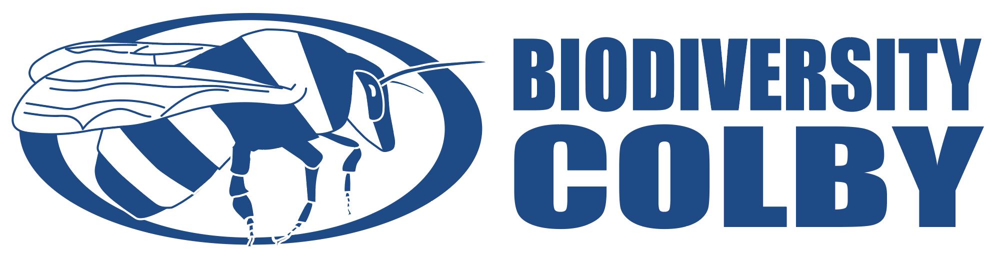

This activity allows members of the [Colby College](https://www.colby.edu/) community to explore and share local biodiversity. 

For students in Dr. Angelini's Spring 2025 [BI164B](https://github.com/aphanotus/openEd/tree/main/BI164.Evolution.and.Diversity#bi164-evolution--diversity), this project has a required component, but is also an opportunity to earn extra credit.

## How to get involved?

1. **Create an account with [iNaturalist](https://www.inaturalist.org/)**. It's free and your participation as a community scientist will benefit ecological and biodiversity research! Download the app to your smart device or create an account at https://www.inaturalist.org/ 
2. **Join [Biodiversity Colby](https://www.inaturalist.org/projects/biodiversity-colby)**. Search for the project "Biodiversity Colby" or follow this link to our [iNaturalist project page](https://www.inaturalist.org/projects/biodiversity-colby). Then just click the "Join" button in the upper right.
3. **Upload pictures of living things**. Use your cell phone's camera or any other digital camera. You can upload "Observations" from within the iNaturalist app, either in real time or from your photo reel. Digital camera photos can be transferred to a computer and uploaded on the iNaturalist website. Once you've joined the Project, all your qualifying observations will automatically be added to [Biodiversity Colby](https://www.inaturalist.org/projects/biodiversity-colby).

All members of the Colby College Community are welcome to participate!

## BI164 BioBlitz

An important goal of *[BI164 Evolution and Diversity](https://github.com/aphanotus/openEd/tree/main/BI164.Evolution.and.Diversity#bi164-evolution--diversity)* is to appreciate the amazing range of living things. Towards that end, involvement will compose 10 points towards your class participation score. 

### Course assignment

| title       | points | description                                                  |
| :-------- | :----: | :----------------------------------------------------------- |
| Team Member |   10   | Submit at least 10 observations, representing at least 5 different phyla |

Extra credit (bonus points) will also be awarded to students involved in this project, with special bonuses for project leaders.

### Bonus awards

| title | points | description |
|:------ |:---:|:--------------- |
| Above Average | 2 | In the upper 50% of observation numbers |
| Award for Active Animals | 5 | Most phyla of animals |
| Herald of Spring (Global)  |  5   | Earliest [bumble bee](https://www.inaturalist.org/taxa/52775-Bombus) observation of the year, outside Maine |
| Herald of Spring (Local)   |  5   | Earliest [bumble bee](https://www.inaturalist.org/taxa/52775-Bombus) observation of the year, in Maine |
| Local Legend               |  5   | Most observations made on [Colby's campus grounds](https://www.google.com/maps/@44.5638729,-69.6670136,1443m/data=!3m1!1e3) |
| World Traveler             |  3   | Observation farthest away from Mayflower Hill |
| Go-Getter                  |  3  | Most observations made before Friday, March 21              |
| Early Riser                |  3   | Most observations made between 5:00am and 8:00am             |
| Night Owl                  |  3   | Most observations made between 10:00pm and 12:00pm           |
| Welcoming Committee        |  5   | Most [introduced species](https://en.wikipedia.org/wiki/Introduced_species) observed |
| Super Duper Cuteness Award |  3   | Cutest organism                                              |
| Red in Tooth & Claw        |  3   | Most dangerous organism (Please, don't *do* anything dangerous!) |

### Taxon-specific awards

These awards ago to the student who submits the most species in each taxon below.

| title | points | taxon |
|:-------- |:---:|:-------------- |
| Master of Mammals | 5 | [mammals](https://www.inaturalist.org/taxa/40151-Mammalia) |
| Dinosaur Hunter | 5 | [birds](https://www.inaturalist.org/observations?taxon_id=3) |
| Herp Hero | 5 | [reptiles](https://www.inaturalist.org/taxa/26036-Reptilia) and [amphibians](https://www.inaturalist.org/taxa/20978-Amphibia) |
| Crocodile Hunter | 5 | [crocodilians](https://www.inaturalist.org/taxa/26039-Crocodylia) |
| Award for Aquatic Awesomeness | 5 | fish (including [Actinopterygii](https://www.inaturalist.org/taxa/47178-Actinopterygii), [Elasmobranchs](https://www.inaturalist.org/observations?taxon_id=47273), and anything fishy) |
| Urovision Award | 5 | [urochordates](https://www.inaturalist.org/taxa/130868-Tunicata) |
| Excellence in Echinoderms | 5 | [echinoderms](https://www.inaturalist.org/taxa/47549-Echinodermata) |
| Master of Metamorphosis | 5 | [holometabolous insects](https://www.inaturalist.org/observations?taxon_id=47158) |
| Best in Bugs | 5 | hemimetabolous [insects](https://www.inaturalist.org/taxa/47158-Insecta) |
| Exoskeletal Extravert | 5 | [crustaceans](https://www.inaturalist.org/taxa/85493-Crustacea) |
| Award for Most Legs | 5 | [myriapods](https://www.inaturalist.org/taxa/144128-Myriapoda) |
| Amazing Spiderperson | 5 | [chelicerates](https://www.inaturalist.org/taxa/245097-Chelicerata), including [spiders](https://www.inaturalist.org/taxa/47118-Araneae) |
| Worm Warrior | 5 | [annelids](https://www.inaturalist.org/taxa/47491-Annelida) |
| Clam Champ | 5 | [molluscs](https://www.inaturalist.org/observations?taxon_id=47115) |
| Award for Finding Nemo | 5 | [nematodes](https://www.inaturalist.org/taxa/54960-Nematoda) |
| Order of the Green Beret | 5 | [dicots](https://www.inaturalist.org/taxa/47124-Magnoliopsida) |
| Greatest in Grass | 5 | [monocots](https://www.inaturalist.org/taxa/47163-Liliopsida) |
| Pine Tree State Champion | 5 | [conifers](https://www.inaturalist.org/taxa/136329-Pinopsida) |
| Fern Fiend | 5 | [Pteridophytes](https://www.inaturalist.org/taxa/121943-Polypodiopsida) |
| Master of Moss | 5 | [Bryophytes](https://www.inaturalist.org/taxa/311249-Bryophyta) |
| Chopped Liver | 5 | [Marchantiophyta](https://www.inaturalist.org/taxa/64615-Marchantiophyta) (liverworts) |
| Super Spore | 5 | [Ascomycota](https://www.inaturalist.org/taxa/48250-Ascomycota) |
| Master of Mycology | 5 | [Basidiomycota](https://www.inaturalist.org/taxa/47169-Basidiomycota) |
| Most Symbiotic | 5 | [lichens](https://www.inaturalist.org/taxa/54743-Lecanoromycetes) |
| Kelp Keeper | 5 | [Chromista](https://www.inaturalist.org/taxa/48222-Chromista) |
| Red Badge of Courage | 5 | [Rhodophyta](https://www.inaturalist.org/taxa/57774-Rhodophyta) |
| Alveolate Ally | 5 | [Dinoflagellates](https://www.inaturalist.org/taxa/1410906-Dinoflagellata/) |
| Super Slime | 5 | [slime molds](https://www.inaturalist.org/taxa/47685-Mycetozoa) |
| Woese Award for Unusual Effort | 5 | [Archaea](https://www.inaturalist.org/taxa/151817-Archaea) and [Bacteria](https://www.inaturalist.org/taxa/67333-Bacteria) |
| Order of Orthogenesis | 3 | [moose](https://www.inaturalist.org/taxa/522193-Alces-alces) |

### Rules

- Remember, this is meant to be fun! (and educational)
- Observations must be submitted to iNaturalist between March 15 and May 11, 2025.
- Students must submit their own observations 
- Students must provide a reasonable identification of each organism at the time it is submitted. However, the observation will count towards the taxon that the iNaturalist community ultimately identifies it as.
- To count towards an award, organisms must be in their natural environment. (Greenhouses, zoos, aquariums, natural history collections, etc. don't count.) 
- Humans and pets cannot be submitted as observations
- New bonus awards may be added at any time!
- Runners-up will receive half the award value, rounded down, unless there is a tie.
- In the event of a tie, winners will split the point value, rounded up.
- The total for bonus points from this project will be capped at 20 points for each student.
- Dr. Angelini has ultimate discretion to determine all outcomes of this competition, including judgements of "cuteness" and "danger".

### Tips

- This activity is meant to be fun and friendly. So please cheer on your classmates!
- You don't need to venture far away! Plenty of organisms live right beside us if you just look around, and slow down enough to be observant. 
- It's always a good idea to go in a group when [venturing into natural areas](https://www.nature.org/en-us/about-us/where-we-work/united-states/ohio/stories-in-ohio/top-10-tips-for-outdoor-safety/). If you are unfamiliar with outdoor activities please seek the advice of more experienced people.
- If you collect organisms that are microscopic, talk with Dr. Angelini or your lab instructor about using a microscope to take pictures. Please realize that this might not always be possible due to timing or logistical constraints.
- The list of taxa above is really long! It's not expected that you should make observations of every one! This activity is not meant to take up all of your time!

### Results

***Watch here for an update on the results so far!***

