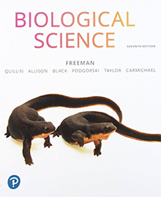

# BI164 Evolution & Diversity

**Colby College  -  Spring 2025  -  Section B  -  Syllabus**

#### Meeting times

Mondays, Wednesdays and Fridays 10-10:50 am, [Olin 001](https://map.colby.edu/)

#### Instructor

[Dr. David R. Angelini](https://www.colby.edu/people/people-directory/dave-angelini/) 

e-mail: [dave.angelini@colby.edu](mailto:dave.angelini@colby.edu)

Office hours: [TBD](https://docs.google.com/forms/d/e/1FAIpQLSdOAN1m0mFAcKsBidD8sVxt4MHCZPYKzDqa1Dj3thMcL2WcIA/viewform?usp=sharing)

#### Learning Assistants

- TBD

##### LA Sessions

TBD

### Course Description

Biological diversity supports the existence of life itself. It is also a source of genuine wonder. In this course, we will introduce the study of biological diversity at multiple scales. We will examine how patterns of inheritance arise from its molecular and cellular nature. You will learn why and how evolution occurs in populations and across eons of time to generate the amazing diversity of life. We will explore this diversity in major lineages of organisms. What you learn in this course will be foundational for further the study of biology and related subjects. 

### Course Objectives

1. Understand how genetic information moves from parents to offspring 
2. Understand how genetic information moves through populations over time and how this process is related to the origins of species over long time scales
3. Build foundational knowledge about some major eukaryotic lineages of organisms
4. Develop skills in laboratory techniques, data analysis, and scientific writing

#### Required textbook

*Biological Science*, Scott Freeman, et al., 7th edition. 

I encourage you to purchase <a href="https://www.powells.com/book/biological-science-9780134678320" target="_blank">used copies</a> of the textbook. 

You should complete the assigned readings before each class. Reading in advance will allow you to engage in that day's activities.

### Class meetings

This course is intended to be an introduction to major concepts in biology. Classes will be a mixture of lecture and small group work. Your active engagement is important to your development of skills and an understanding of biology. Therefore attendance is expected. 

Class rosters are provided to each instructor with each student's legal name. I will gladly honor your request to address you by an alternate name or gender pronoun. Please advise me of this early in the semester so that I can make appropriate changes to my records. 

Be aware that classes cannot be missed for an athletic practice. However, if your request is made in advance, I typically allow absences for athletic competition. 

Your involvement with in-class assignments will be assessed weekly, and cannot be made-up if you are absent. If you are aware in advance that you must miss class for exceptional circumstances, please discuss this with me in advance. Isolated, occasional absences are tolerable; frequent absences will negatively affect your participation grade. Attending a different section of BI164 is not an acceptable way to make up for a missed class. (The other sections may be discussing a completely different topic on any day.) Poor attendance will also result in an academic warning.

### Laboratory

The lab will give you hands-on experience exploring the principles of biology discussed in class. You will learn about the practical aspects of the way that scientists do biology: experimental techniques, proper use of equipment, methods of data analysis, and abundant scientific writing. These concepts serve as a foundation for more advanced courses in the biology major. Attend the laboratory section assigned to you. All aspects of laboratory (communication, assignments, instruction) will be managed by your lab instructor.

### Grades

Your final grade for BI164 will be based on the lecture and laboratory sections of the course. The specifics of your laboratory grade, and a lab syllabus, will be provided by your lab instructor.

| course component                    | points |
| :---------------------------------- | :----: |
| Lab  |  300  |
| In-class activities and class participation |  130   |
| Quizzes (9)        |  90  |
| Midterm exams (3, each worth 120 pts) |  360  |
| Cumulative final exam              |  120  |
| **total**                          | 1,000  |

Students must earn a passing grade (>60%) in their lab section in order to pass the course.

Assignments are not accepted late, except in the case of a valid, compelling and documented justification.

No individual extra credit assignments will be offered. 

| point range | final grade assigned                                |
| :---------- | :-------------------------------------------------- |
| > 900       | A (<930 A-, >930 A, A+ for exceptional performance) |
| 800-900     | B (<830 B-, 830-870 B, >870 B+)                     |
| 700-800     | C (<730 C-, 730-770 C, >770 C+)                     |
| 600-700     | D (<630 D-, 630-670 D, >670 D+)                     |
| < 600       | F                                                   |

### Exams
There will be three midterm exams during the semester, and one comprehensive (cumulative) final exam covering the whole semester. Midterm exams will be closed-book, closed-note, individual-effort exams given in our regular class time on the dates below.

| exam       | date            |
| :--------- | :-------------- |
| Midterm 1  | Monday, March 3 |
| Midterm 2  | Monday, April 7 |
| Midterm 3  | Monday, May 5   |
| Final Exam | TBA             |

### Learning management platform (Moodle)

Moodle ( http://moodle.colby.edu/ ) will be my primary method for communicating materials and announcements to you outside of class. There you will also find the course [syllabus](https://github.com/aphanotus/openEd/blob/main/BI164.Evolution.and.Diversity/README.md) and the schedule of topics, assignments, and PDF files from lecture slides. To contact me, please email.

### Access and Support

First, please speak with me early if you are having trouble in the course.

- [Counseling Services](http://www.colby.edu/counseling/) (207-859-4490) provided from the Health Center offer professional, confidential consultations regarding family problems, stress, depression, cultural adjustments, concerns with sexuality, alcohol and drug use, trauma and other personal issues.
- [Class Deans](mailto:deanofstudies@colby.edu) can guide students through a range of issues. Students can reach out to their class dean via email or by calling x4560. They are also welcome to visit the Dean of Studies Office in Eustis 107 for assistance with scheduling or other inquiries. 
- If you encounter barriers to your full participation in this course, please let me know immediately so we can determine if there is an accommodation that can be made. If you are a student with a disability, or think you may have a disability, the [Dean of Students Office](https://www.colby.edu/studentadvising/student-access-and-disability-services/) works with students and faculty to identify reasonable accommodations. 
- The [Farnham Writing Center](http://web.colby.edu/farnham-writerscenter/) offers support for students on basic writing and reading skills.
- [DavisConnects](https://davisconnects.colby.edu/) helps students  explore internship, career, and study abroad opportunities. Make [an appointment](https://colby.joinhandshake.com/login) with an advisor through the Handshake portal.

### Sustainability 

Environmental degradation is a serious biological and societal issue. [Colby](https://www.colby.edu/green-colby/) is committed to practices that promote environmental sustainability. To help minimize the environmental impact of this course, I encourage you to buy used textbooks. Minimize paper use by reading slides on a device when possible, rather than printing on paper. It is acceptable to take notes on a laptop or tablet during class. If you choose to print, please print double-sided on recycled paper. Multiple slides may be printed to a single sheet. Recycle unnecessary paper after the end of the semester.

### Academic Integrity 

Honesty, integrity, and personal responsibility are cornerstones of a Colby education and provide the foundation for scholarly inquiry, intellectual discourse, and an open and welcoming campus community. [These values](https://www.colby.edu/academics/academic-integrity/) are articulated in the Colby Affirmation and are central to this course. You are expected to demonstrate academic honesty in all aspects of this course. Academic dishonesty includes, but is not limited to: [plagiarism](https://libguides.colby.edu/avoidingplagiarism) (which includes paraphrasing from sources, even with a citation); claiming the work of another person or [AI](https://www.edweek.org/technology/new-data-reveal-how-many-students-are-using-ai-to-cheat/2024/04) as your own; buying or attempting to buy papers or other assignments; fabricating information or citations; knowingly assisting others in acts of academic dishonesty; violating clearly stated rules for taking an exam; misrepresentations to faculty within the context of a course; and submitting the same work, including an essay that you wrote, in more than one course. Sanctions for academic dishonesty are assigned by an [academic review board](https://www.colby.edu/wp-content/uploads/2021/01/StudentAcadDishFlowChart-7.pdf) and may include failure on the assignment, failure in the course, suspension or expulsion from the College.

### Sexual Misconduct

Colby College prohibits [sexual misconduct or gender based discrimination](https://life.colby.edu/your-safety/sexual-violence-title-ix/title-ix-policy-guidance/) and is obligated, by federal and state laws, to respond to reports and provide resources to students. As your professor I am considered a "responsible employee" which requires me to report incidence of sexual assault, sexual harassment, dating violence, or stalking to the [Title IX Coordinator](https://life.colby.edu/your-safety/sexual-violence-title-ix/meet-the-staff/). 

Confidential support services: 

- [Counseling Services](http://www.colby.edu/counseling/) (207-859-4490) 
- [Title IX Confidential Advocate](https://life.colby.edu/your-safety/sexual-violence-title-ix/meet-the-staff/) (207-509-9122) 
- [Office of Religious and Spiritual Life](https://life.colby.edu/what-to-do/spiritual-life/) (207-859-4272 )
- [Maine Coalition Against Sexual Assault](https://www.mecasa.org/) (24/7 helpline: 1-800-871-7741)

### Accommodations for public health

If you test positive for SARS-CoV-2 or experience [symptoms of covid-19](https://www.cdc.gov/covid/signs-symptoms/), [flu](https://www.cdc.gov/flu/signs-symptoms/index.html) please only attend class if wearing a [KN-95](https://www.cdc.gov/respiratory-viruses/prevention/masks.html) face mask or similar design.

### Course Schedule

| week of | topic                          | reading                            |
| ----------- | ------------------------------ | ---------------------------------- |
| February 5 | Introductions & Overview       | Freeman Ch 1.3-5                   |
| February 10 | Chromosomes and their movements | 12.0-2; 13.0-3; 27.0-1,3-4; 28.0-3 |
| February 17 | Transmission genetics          | 14.0-2                             |
| February 24 | Inheritance of multiple traits | 14.3-6; 29.0-4                     |
|  | ***Midterm 1 is March 3*** |  |
| March 3     | Population genetics            | 23.0-1,6,2                         |
| March 10    | Genetic drift                  | 23.5,4                             |
| March 17 | Natural Selection              | 23.3; 22.4                         |
| March 24    | *Spring break*               |                                    |
| March 31    | Tree thinking                  | 22.0-3                             |
|  | ***Midterm 2 is April 7*** |  |
| April 7     | Macroevolution                 | 22.5; 25.2-4                       |
| April 14    | Speciation                     | 24.0-4                             |
| April 21    | Phylogenetics                  | 25.0-1                             |
| April 28    | Important evolutionary transitions | 30.0-4; 31.0-3; 32.1-5             |
|  | ***Midterm 3 is May 5*** |  |
| May 5       | Biodiversity                   | 54.0-1                             |
|  | ***Final exam  date and time  TBA*** |  |

