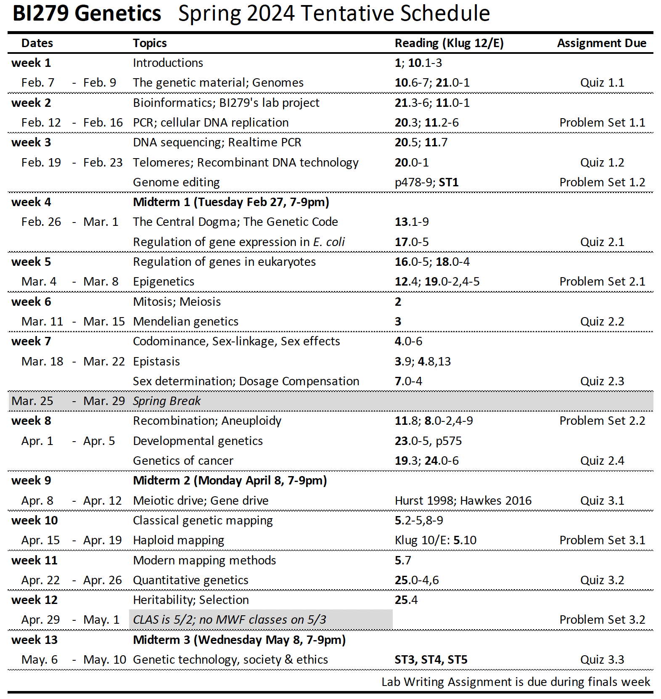

# BI279  Genetics

**Colby College  -  Spring 2024  -  Syllabus**

#### Meeting times

Mondays, Wednesdays, and Fridays 11:00-11:50am, in [Lovejoy 215](https://map.colby.edu/)

#### Instructor

[Dr. David R. Angelini](https://www.colby.edu/people/people-directory/dave-angelini/) 

e-mail: [dave.angelini@colby.edu](mailto:dave.angelini@colby.edu)

Office hours: Arey 112, Wednesdays 12-1pm, Thursdays 11-12pm, or by appointment

### Prerequisite

BI164 Evolution & Diversity

### Course Description

Genetics is the study of heredity and its connections to living systems at all levels. This course covers basic genetic principles as revealed by classical and modern research methods. We will discuss patterns and mechanisms of gene transmission, the nature of chromosomes and their aberrations, the molecular structure of genes as well as their expression and interactions, and applications of genetic technology. The lecture component of the course is complemented by the lab, in which students will conduct experiments illustrating genetic concepts and employing recombinant DNA technology.

### Learning Objectives

Throughout this course, our goals are for students to:

- identify and describe core concepts of inheritance
- develop skills to reason through problems in genetics
- analyze genetic data and draw appropriate conclusions
- use scientific evidence to assess and contextualize genetics problems applicable to society
- communicate concepts of genetics clearly and accurately
- practice learning as an iterative process

### Online resources

Moodle ( http://moodle.colby.edu/ ) will be the primary electronic method of contact for this course. Announcements and material related to the course will be posted there frequently, so please check the site on a regular basis. On the site you will also find the course syllabus and the schedule of topics, assignments, and PDF files from lecture slides.   

### Suggested text

There are is no required textbook for this course. However, students are **strongly encouraged** to read from the following text:

- Klug W.S. et al. *Concepts of Genetics, 12th Edition*. 2019. Pearson/Benjamin Cummings. Students are encouraged to purchase used copies of the textbook. Support cannot be provided­ for older or international editions of this text. 

Additional readings will be provided via Moodle.

### Participation

Classes will involve a combination of instructor presentation, in-class problem solving individually and in groups, as well as class discussion. Therefore, attendance and your engagement are expected. Classes should be considered conversational, so please feel free to ask questions at any time. Because of the interactive nature of this course, attendance and engagement are critical. Please contact me if you anticipate an absence from class. Be aware that classes cannot be missed for an athletic practice. However, if your request is made in advance, I generally allow absences for an athletic contest. Poor attendance will negatively affect your participation grade and may result in an academic warning. During class, please be considerate of other students and make sure that any electronic device is muted. 

Class rosters are provided to instructors listing your name as recorded by the college. I will gladly honor your request to address you by a preferred name and/or gender pronouns. Please advise me of this early in the semester so I can make an appropriate note in my records for the course. 

Discussions of genetics may raise issues of sexism, racism and colonialism. While this course will focus on biology, the social history of the topic must be acknowledged as we seek to build a more antiracist community. Therefore, it is expected that conversations on these topics, while potentially uncomfortable, will be embraced with respect, compassion and mindful reflection. At any time, if anyone feels that readings, comments in discussion, or structures of the course treat these subjects inappropriately, that critique is welcomed, openly or privately. 

### Grades

Your grade for BI163 will be based on the lecture (70%) and laboratory (30%) sections of the course. The specifics of your laboratory grade, and a lab syllabus, will be provided by your lab instructor. Your final grade for the course will be calculated based on a 1000 point total as listed below. 

| assessment                       | points |
| -------------------------------- | -----: |
| In-class participation           |     45 |
| Quizzes (9; 5 points each)       |     45 |
| Problem sets (6; 35 points each) |    210 |
| Midterm 1 (February 27)          |    120 |
| Midterm 2 (April 8)              |    140 |
| Midterm 3 (May 8)                |    140 |
| Lab Assignments                  |    300 |
| **total**                        |   1000 |

| points        | final course grade |
| ------------- | ------------------ |
| 900-1000      | A (of some kind)   |
| 800-899       | B (of some kind)   |
| 700-799       | C (of some kind)   |
| 600-699       | D (of some kind)   |
| less than 599 | F                  |

Remember that while diligent studying is typically essential for success, on its own effort is not sufficient to merit a high grade. The grade of “A” is meant to denote exceptional work.

### Brief explanation of course assessments

This course will include a mix of formative and summative assessments. **Formative assessments** are meant to encourage you to build knowledge and skills, and they allow you to gauge your progress with the material before more high-stakes assessments. In these assignments you have flexibility to try (and perhaps fail) to apply skills and concepts with little or no contribution to your final grade at stake. However, to get the most out of this course, your engagement in every activity is necessary. You will encounter multiple overlapping concepts throughout the semester and review from previous courses. This design is intentional, because it will foster greater fluency and deeper understanding. **Summative assessments**, such as exams and the final lab paper allow you to demonstrate mastery of content and concepts.

- **Participation** can best be described as displaying your earnest attempt to engage the material. Although I encourage all of you to be active participants during in-class activities, I realize that different people may be comfortable expressing themselves in different contexts. Therefore, participation may also include questions after class or brought during office hours. 

- **Quizzes** will be given regularly, typically via Moodle, and typically over the weekend. Quizzes are meant to be low-stakes tests of your knowledge from the previous week’s material, providing an opportunity for us both to gauge how you’re doing. 

- **Problem sets** are formative assessments that will challenge you to apply facts and concepts covered in class. Your answers should be descriptive, even when questions require a specific numerical answer. The logical steps used to arrive at the answer must be included. Students may consult any source they choose and work together when answering the questions, but each student must turn in answers explained in their own words. 

- **Midterm** exams are summative assessments meant to sample your knowledge and understanding. You will be expected to know specific facts, basic concepts, and the purpose and interpretation of experiments. The highest grades will require creative solutions to novel questions. Each exam will include a mix of questions in different formats. Unless otherwise announced, exams will be given in the evenings, 7-9pm, on 27 February, 8 April, and 8 May. If you know that you have a conflict with a scheduled exam, such as for an athletic contest or religious observance, please notify me at least one week in advance and, if possible, arrangements will be made to accommodate your request.

- **The lab** will give you hands-on experience exploring the principles of genetics discussed in class. You will learn about the proper use of equipment, manipulation of DNA, methods of data analysis, and practice scientific writing. Most aspects of the laboratory (communication, assignments, instruction) will be managed by your lab instructor. Please be aware that a passing grade in your lab section is required to pass the course.

If you plan to observe religious holidays that coincide with class meetings or assignment due dates, please consult with me in the first three weeks of classes so that we may reach a mutual understanding of how you can meet the terms of your religious observance and the requirements for this course. 

Late assignments without prior approval may be penalized (10% of the grade for each late day). Assignments that are late more than 7 days will not be accepted without prior agreement. 

### Academic support

If you experience difficulty in this course for any reason, a wide range of services are available from the College to support you.

- First, please speak with me early if you are having trouble in the course. 
- The [Farnham Writing Center](http://web.colby.edu/farnham-writerscenter/) offers support for students on writing skills.
- If you have already been approved for academic accommodations, please connect within the two weeks of the start of the semester so the office can develop an implementation plan. Please do this as soon as possible to ensure that approved accommodations can be implemented in a timely fashion.
- If you need formal arrangements to accommodate specific learning or physical abilities, please communicate with me early in their semester, so that I can work towards a more inclusive course. Please also contact the [Dean of Students Office](https://www.colby.edu/studentadvising/student-access-and-disability-services/), which works with students and faculty members to identify reasonable accommodations.
- Mental and emotional challenges can be unforeseen. If you are in need of reasonable flexibility due to such issues, please communicate as openly as possible with your class dean or members of the [Dean of Students Office](https://www.colby.edu/studentadvising/student-access-and-disability-services/). Together, we will consider what is needed and what is possible to manage the situation together.
- [Counseling Services](https://life.colby.edu/your-health/counseling-services/) (x4490, press "0" outside business hours) are also available, providing confidential consultations regarding issues including family problems, stress, depression, cultural adjustments, concerns with sexuality, alcohol and drug use, or trauma.

### Academic honesty 

Honesty, integrity, and personal responsibility are cornerstones of a Colby education and provide the foundation for scholarly inquiry, intellectual discourse, and an open and welcoming campus community. These values are articulated in the Colby Affirmation and are central to this course. Students are expected to demonstrate academic honesty in all aspects of this course. Academic dishonesty includes, but is not limited to: plagiarism (which includes paraphrasing from sources, even with a citation); claiming another’s work  (including AI-generated content) or a modification of another’s work as one’s own; buying or attempting to buy papers or other assignments; fabricating information or citations; knowingly assisting others in acts of academic dishonesty; violating clearly stated rules for taking an exam; misrepresentations to faculty within the context of a course; and submitting the same work, including an essay that you wrote, in more than one course. Sanctions for academic dishonesty are assigned by an academic review board and may include failure on the assignment, failure in the course, or suspension or expulsion from the College.

For more information on recognizing and avoiding plagiarism, see these guides:

- [Avoiding Plagiarism](http://libguides.colby.edu/avoidingplagiarism)
- [Academic Honesty](http://web.colby.edu/farnham-writerscenter/academic-honesty/)

### Accommodations for public health

Cooperation with the [college’s plan for pandemic response](https://covid19.colby.edu/covid-19-health-and-safety/) is expected. Specific impacts to this course include:

- If you test positive for SARS-CoV-2 or experience [symptoms of covid-19](https://www.cdc.gov/coronavirus/2019-ncov/symptoms-testing/symptoms.html), including fever or chills, cough, fatigue and headache, do not attend class in person. Please notify your professors and advising dean.
- If you experience any symptoms of flu, covid or other airborne illnesses, please wear a [KN-95 mask](https://www.cdc.gov/coronavirus/2019-ncov/prevent-getting-sick/types-of-masks.html) or similar design.
- In the case of a covid case surge, it may become necessary for the course to transition to a Zoom format. In which case, changes to the syllabus may be necessary.

### Sustainability 

Environmental degradation is a serious biological and societal issue. [Colby](https://www.colby.edu/people/offices-directory/facilities/sustainability/) is committed to practices that promote sustainable living. To help minimize the environmental impact of this course, I encourage you to buy used books. Minimize paper use by reading slides on a device when possible, rather than printing copies. It is acceptable to take notes on a laptop or tablet during class. If you choose to print, please print double-sided on recycled paper. Multiple slides may be printed to a single sheet. Recycle unnecessary paper after the end of the semester.

### Tentative Course Schedule

