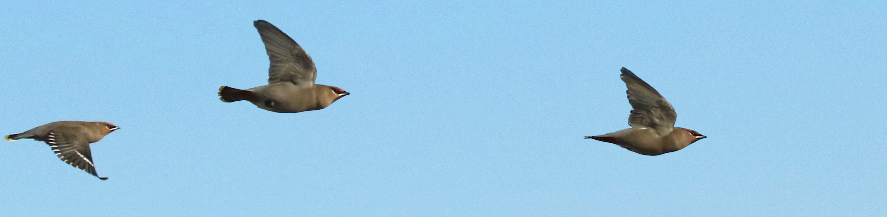
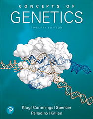
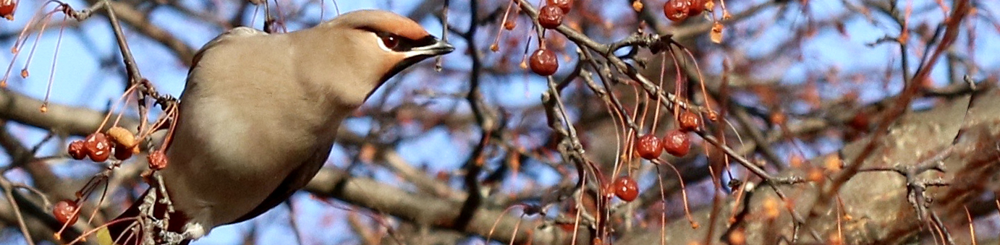

# BI279 Genetics

**Colby College  -  Spring 2025  -  Syllabus**

#### Meeting times

Mondays, Wednesdays, and Fridays 11:00-11:50am, in [Lovejoy 215](https://map.colby.edu/)

#### Instructor

[Dr. David R. Angelini](https://www.colby.edu/people/people-directory/dave-angelini/) 

e-mail: [dave.angelini@colby.edu](mailto:dave.angelini@colby.edu)

Office hours: [TBD](https://docs.google.com/forms/d/e/1FAIpQLSdOAN1m0mFAcKsBidD8sVxt4MHCZPYKzDqa1Dj3thMcL2WcIA/viewform?usp=sharing)

### Prerequisite

[BI164 Evolution & Diversity](https://github.com/aphanotus/openEd/tree/main/BI164.Evolution.and.Diversity#bi164-evolution--diversity)

### Course Description

Genetics is the study of heredity and its connections to living systems at all levels. This course covers basic genetic principles as revealed by classical and modern research methods. We will discuss patterns and mechanisms of gene transmission, the nature of chromosomes and their aberrations, the molecular structure of genes as well as their expression and interactions, and applications of genetic technology. The lecture component of the course is complemented by the lab, in which students will conduct experiments illustrating genetic concepts and employing recombinant DNA technology.

### Learning Objectives

Throughout this course, our goals are for students to:

- identify and describe core concepts of inheritance
- develop skills to reason through problems in genetics
- analyze genetic data and draw appropriate conclusions
- use scientific evidence to assess and contextualize genetics problems applicable to society
- communicate concepts of genetics clearly and accurately
- practice learning as an iterative process

### Suggested textbook

There are is no required textbook for this course. However, students are **strongly encouraged** to read from the following text:

Klug W.S. et al. *Concepts of Genetics, 12th Edition*. 2019. Pearson/Benjamin Cummings. Students are encouraged to purchase used copies of the textbook. Support cannot be provided­ for older or international editions of this text. 

Additional readings will be provided via Moodle.

### Class meetings

Classes will involve a combination of instructor presentation, in-class problem solving individually and in groups, as well as class discussion. Therefore, attendance and your engagement are expected. Classes should be considered conversational, so please feel free to ask questions at any time. 

Class rosters are provided to each instructor with each student's legal name. I will gladly honor your request to address you by an alternate name or gender pronoun. Please advise me of this early in the semester so that I can make appropriate changes to my records. 

Because of the interactive nature of this course, attendance and engagement are critical. Please contact me if you anticipate an absence from class. 

Be aware that classes cannot be missed for an athletic practice. However, if your request is made in advance, I typically allow absences for athletic competition. 

If you are aware in advance that you must miss class for exceptional circumstances, please discuss this with me in advance. Isolated, occasional absences are tolerable; frequent absences will negatively affect your participation grade.

Discussions of genetics may raise issues of sexism, racism and colonialism. While this course will focus on biology, the social history of the topic must be acknowledged as we seek to build a more antiracist community. Therefore, it is expected that conversations on these topics, while potentially uncomfortable, will be embraced with respect, compassion and mindful reflection. At any time, if anyone feels that readings, comments in discussion, or structures of the course treat these subjects inappropriately, that critique is welcomed, openly or privately. 

### Grades

Your grade for BI279 will be based on the lecture (70%) and laboratory (30%) sections of the course. The specifics of your laboratory grade, and a lab syllabus, will be provided by your lab instructor. Your final grade for the course will be calculated based on a 1000 point total as listed below. 

| course component                   | points |
|:---------------------------------- | -----: |
| In-class participation             |     50 |
| Quizzes (10 x 5 points each)       |     50 |
| Problem sets (4 x 75 points each)  |    300 |
| Midterm exams (4 x 75 points each) |    300 |
| Lab                                |    300 |
| **total**                          |   1000 |

Students must earn a passing grade (>60%) in their lab section in order to pass the course.

Assignments are not accepted late, except in the case of a valid, compelling and documented justification.

No individual extra credit assignments will be offered. 

| point range | final grade assigned                                |
| :---------- | :-------------------------------------------------- |
| > 900       | A (<930 A-, >930 A, A+ for exceptional performance) |
| 800-900     | B (<830 B-, 830-870 B, >870 B+)                     |
| 700-800     | C (<730 C-, 730-770 C, >770 C+)                     |
| 600-700     | D (<630 D-, 630-670 D, >670 D+)                     |
| < 600       | F                                                   |

Remember that while diligent studying is typically essential for success, on its own effort is not sufficient to merit a high grade. The grade of “A” is meant to denote exceptional work.

### Brief explanation of course assessments

This course will include a mix of formative and summative assessments. **Formative assessments** are meant to encourage you to build knowledge and skills, and they allow you to gauge your progress with the material before more high-stakes assessments. In these assignments you have flexibility to try (and perhaps fail) to apply skills and concepts with little or no contribution to your final grade at stake. However, to get the most out of this course, your engagement in every activity is necessary. You will encounter multiple overlapping concepts throughout the semester and review from previous courses. This design is intentional, because it will foster greater fluency and deeper understanding. **Summative assessments**, such as exams allow you to demonstrate mastery of content and concepts.

- **Participation** can best be described as displaying your earnest attempt to engage the material. Although I encourage all of you to be active participants during in-class activities, I realize that different people may be comfortable expressing themselves in different contexts. Therefore, participation may also include questions after class or brought during office hours. 

- **Quizzes** will be given regularly, typically via Moodle, and typically over the weekend. Quizzes are meant to be low-stakes tests of your knowledge from the previous week’s material, providing an opportunity for us both to gauge how you’re doing. 

- **Problem sets** are formative assessments that will challenge you to apply facts and concepts covered in class. Your answers should be descriptive, even when questions require a specific numerical answer. The logical steps used to arrive at the answer must be included. Students may consult any source they choose and work together when answering the questions, but each student must turn in answers explained in their own words. The highest grades will require creative solutions to novel questions. Problem sets will be made available for at least one week, around the time of an exam. Problem sets and midterm exams will cover similar content in different formats. 

- **Midterm exams** are summative assessments meant to sample your knowledge and understanding. You will be expected to know specific facts, basic concepts, and the purpose and interpretation of experiments. Each exam will include a mix of questions in different formats. Exams will be given in class, on Mondays. If you know that you have a conflict with a scheduled exam date, such as for an athletic competition or religious observance, please notify me at least one week in advance and, if possible, arrangements will be made to accommodate your request. Students with accommodations for extra time will need to contact the [Alternative Testing Center](https://life.colby.edu/get-support/access-disability-services/#:~:text=Using%20The-,Alternative,-Testing%20Center) to schedule an individually proctored time within 36 hours of the scheduled exam.

- **The lab** will give you hands-on experience exploring the principles of genetics discussed in class. You will learn about the proper use of equipment, manipulation of DNA, methods of data analysis, and practice scientific writing. Most aspects of the laboratory (communication, assignments, instruction) will be managed by your lab instructor. Please be aware that a passing grade in your lab section is required to pass the course.

If you plan to observe religious holidays that coincide with class meetings or assignment due dates, please consult with me in the first three weeks of classes so that we may reach a mutual understanding of how you can meet the terms of your religious observance and the requirements for this course. 

Late assignments without prior approval will be penalized 10% of the grade for each late day. Assignments that are late more than 7 days will not be accepted. 

### Learning management platform (Moodle)

Moodle ( http://moodle.colby.edu/ ) will be my primary method for communicating materials and announcements to you outside of class. There you will also find the course [syllabus](https://github.com/aphanotus/openEd/blob/main/BI164.Evolution.and.Diversity/README.md) and the schedule of topics, assignments, and PDF files from lecture slides. To contact me, please email.

### Access and Support

First, please speak with me early if you are having trouble in the course.

- [Counseling Services](http://www.colby.edu/counseling/) (207-859-4490) provided from the Health Center offer professional, confidential consultations regarding family problems, stress, depression, cultural adjustments, concerns with sexuality, alcohol and drug use, trauma and other personal issues.
- [Class Deans](mailto:deanofstudies@colby.edu) can guide students through a range of issues. Students can reach out to their class dean via email or by calling x4560. They are also welcome to visit the Dean of Studies Office in Eustis 107 for assistance with scheduling or other inquiries. 
- If you encounter barriers to your full participation in this course, please let me know immediately so we can determine if there is an accommodation that can be made. If you are a student with a disability, or think you may have a disability, the [Dean of Students Office](https://www.colby.edu/studentadvising/student-access-and-disability-services/) works with students and faculty to identify reasonable accommodations. 
- The [Farnham Writing Center](http://web.colby.edu/farnham-writerscenter/) offers support for students on basic writing and reading skills.
- [DavisConnects](https://davisconnects.colby.edu/) helps students  explore internship, career, and study abroad opportunities. Make [an appointment](https://colby.joinhandshake.com/login) with an advisor through the Handshake portal.

### Sustainability 

Environmental degradation is a serious biological and societal issue. [Colby](https://www.colby.edu/green-colby/) is committed to practices that promote environmental sustainability. To help minimize the environmental impact of this course, I encourage you to buy used textbooks. Minimize paper use by reading slides on a device when possible, rather than printing on paper. It is acceptable to take notes on a laptop or tablet during class. If you choose to print, please print double-sided on recycled paper. Multiple slides may be printed to a single sheet. Recycle unnecessary paper after the end of the semester.

### Academic Integrity 

Honesty, integrity, and personal responsibility are cornerstones of a Colby education and provide the foundation for scholarly inquiry, intellectual discourse, and an open and welcoming campus community. [These values](https://www.colby.edu/academics/academic-integrity/) are articulated in the Colby Affirmation and are central to this course. You are expected to demonstrate academic honesty in all aspects of this course. Academic dishonesty includes, but is not limited to: [plagiarism](https://libguides.colby.edu/avoidingplagiarism) (which includes paraphrasing from sources, even with a citation); claiming the work of another person or [AI](https://www.edweek.org/technology/new-data-reveal-how-many-students-are-using-ai-to-cheat/2024/04) as your own; buying or attempting to buy papers or other assignments; fabricating information or citations; knowingly assisting others in acts of academic dishonesty; violating clearly stated rules for taking an exam; misrepresentations to faculty within the context of a course; and submitting the same work, including an essay that you wrote, in more than one course. Sanctions for academic dishonesty are assigned by an [academic review board](https://www.colby.edu/wp-content/uploads/2021/01/StudentAcadDishFlowChart-7.pdf) and may include failure on the assignment, failure in the course, suspension or expulsion from the College.

### Sexual Misconduct

Colby College prohibits [sexual misconduct or gender based discrimination](https://life.colby.edu/your-safety/sexual-violence-title-ix/title-ix-policy-guidance/) and is obligated, by federal and state laws, to respond to reports and provide resources to students. As your professor I am considered a "responsible employee" which requires me to report incidence of sexual assault, sexual harassment, dating violence, or stalking to the [Title IX Coordinator](https://life.colby.edu/your-safety/sexual-violence-title-ix/meet-the-staff/). 

Confidential support services: 

- [Counseling Services](http://www.colby.edu/counseling/) (207-859-4490) 
- [Title IX Confidential Advocate](https://life.colby.edu/your-safety/sexual-violence-title-ix/meet-the-staff/) (207-509-9122) 
- [Office of Religious and Spiritual Life](https://life.colby.edu/what-to-do/spiritual-life/) (207-859-4272 )
- [Maine Coalition Against Sexual Assault](https://www.mecasa.org/) (24/7 helpline: 1-800-871-7741)

### Accommodations for public health

If you test positive for SARS-CoV-2 or experience [symptoms of covid-19](https://www.cdc.gov/covid/signs-symptoms/) or [flu](https://www.cdc.gov/flu/signs-symptoms/index.html) please only attend class if wearing a [KN-95](https://www.cdc.gov/respiratory-viruses/prevention/masks.html) face mask or similar design.

### Tentative Course Schedule

| week | date        | topic        | reading (Klug)  |
|:----:|:----------- |:------------ |:--------- |
| 1    | February 5  | Introduction; Overview                |                                                              |
|      |             | The chemical nature of inheritance    | 10.3                                                         |
|      | February 7  | Review of DNA structure               | 10.6-7                                                       |
|      |             | Genomes                               | 21.0-1,3-6                                                   |
| 2    | February 10 | Genes and regulatory elements         | 21.3-6                                                       |
|      |             | Semiconservative DNA replication      | 11.0-1                                                       |
|      | February 12 | PCR                                   | 20.3                                                         |
| | February 14 | Reverse transcription; Realtime PCR | 20.3 |
| 3 | February 17 | Cellular DNA replication              | 11.2-6                                                       |
|      |             | Telomeres                             | 11.7                                                         |
|      | February 19 | Chain-termination DNA sequencing      | 20.5                                                         |
|      | February 21 | High-throughput DNA sequencing        |                                                              |
| 4    | February 24 | **Exam 1**                            |                                                              |
|      | February 26 | Restriction endonucleases             | 20.0-1                                                       |
|      | February 28 | Gene editing                          | p478-9; ST1                                                  |
| 5    | March 3     | Transcription                         | 13.0,8-9                                                     |
|      | March 5     | The genetic code                      | 13.1-4,6                                                     |
|      | March 7     | Eukaryotic mRNA processing            | 13.10-11                                                     |
|      |             | Alternative splicing                  | 18.1                                                         |
|      |             | mRNA decay                            | 18.2                                                         |
| 6 | March 10 | Genetic and allelic nomenclature | 4.1-2 |
|     |     | Gene regulation in bacteria           | 16.0-5                                                       |
|      | March 12    | Gal1 regulation in yeast              | 17.6                                                         |
|      |             | Eukaryotic gene regulation            | 17.0-5                                                       |
|      |             | Eukaryotic chromatin structure        | 12.4                                                         |
|      | March 14    | Epigenetics                           | 19.0-1,4                                                     |
|      |             | microRNAs and RNA interference        | 18.3                                                         |
|      |             | Genomic imprinting                    | 19.2                                                         |
| 7    | March 17    | **Exam 2**                            |                                                              |
|      | March 19    | Germline vs. soma                     |                                                              |
|      |             | Mitosis                               | 2.0-2                                                        |
|      |             | Meiosis                               | 2.3-6                                                        |
|      | March 21    | Transmission of alleles for one trait | 3.0-2                                                        |
|      | March 24    | *Spring break*                        |                                                              |
| 8    | March 31    | Independent assortment                | 3.3-6                                                        |
|  | April 2 | Pedigree notation | 3.9 |
|      |      | Statistical genetics                  | 3.7-8                                                        |
|      | April 4     | Partial dominance of alleles          | 4.3                                                          |
|      |             | Codominance of alleles                | 4.4                                                          |
|      |             | Three or more alleles at one locus    | 4.5                                                          |
|      |             | Lethal alleles                        | 4.6                                                          |
|      |             | Sex limitation & sex influence        | 4.12                                                         |
|      |             | Maternal effect inheritance          | 9.4                                                          |
| 9    | April 7     | Chromosomal sex determination         | 7.0-2                                                        |
|      |             | Sex chromosome linkage                | 4.11                                                         |
|      | April 9     | Complementation                       | 4.9                                                          |
|      |             | Epistasis                             | 4.8                                                          |
|      | April 11    | Genetic background                    | 4.13                                                         |
| 10   | April 14    | **Exam 3**                            |                                                              |
|      | April 16    | homologous recombination              | 11.8                                                         |
|      |             | Genetic distance                      | 5.0-2                                                        |
|      |             | The physical basis of crossing over   | 5.8                                                          |
|      | April 18    | Classical 3-point mapping             | 5.3-5                                                        |
| 11   | April 21    | Modern molecular mapping              | 5.7                                                          |
|      |             | Chromosomal & interval mapping        |                                                              |
|      |             | Genome-wide association mapping       | [Corvin et al. 2014](https://pmc.ncbi.nlm.nih.gov/articles/PMC4181332/pdf/nihms629267.pdf) |
|      | April 23    | Aneuploidy                            | 8.0-2,4-6                                                    |
|      |             | Inversions & Translocations           | 8.7-8                                                        |
|      | April 25    | Balancer chromosomes                  |                                                              |
|      |             | Cancer genetics                       | 24.0-6                                                       |
|      |             | Cancer epigenetics                    | 19.3                                                         |
| 12   | April 28    | Meiotic drive                         | [Reinhold et al. 1999](https://pmc.ncbi.nlm.nih.gov/articles/instance/1690076/pdf/10445289.pdf) |
|      | April 30    | Gene drive technology                 | [Kuta 2022](https://www.smithsonianmag.com/smart-news/first-us-open-air-test-of-genetically-modified-mosquitoes-deemed-a-success-180979960/) |
| 13   | May 5       | *Catch-up!*                           |                                                              |
|      | May 7       | **Exam 4**                            |                                                              |
|      | May 9       | Genetics, copyright, and privacy      | [Francis 2014](https://pmc.ncbi.nlm.nih.gov/articles/PMC4888827/) |
|      |             | Eugenics                              |                                                              |
|      |             | Lysenkoism                            | [Dugatkin 2021](https://nautil.us/the-botanist-who-defied-stalin-238183/) |
|      |             | Genetic evidence in US Law            |                                                              |
