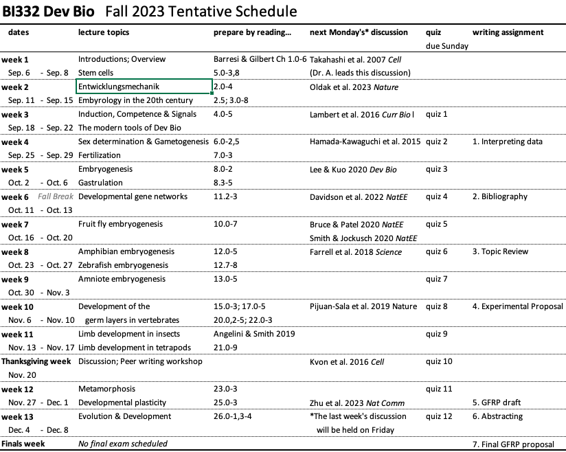

# BI332  Developmental Biology

**Colby College  -  Fall 2023  -  Syllabus**

#### Meeting times

Mondays, Wednesdays, and Fridays 11:00-11:50am, in [Miller 205](https://map.colby.edu/)

#### Instructor

[Dr. David R. Angelini](https://www.colby.edu/directory/profile/dave.angelini/) 

e-mail: [dave.angelini@colby.edu](mailto:dave.angelini@colby.edu)

Office hours: Tuesdays and Thursdays 10:30am-12pm, or by appointment

### Prerequisites

At least of the following: BI227, BI279, BI347, BC362, BC367 or instructor authorization

### Course Description

Developmental biology is the study of the formation and growth of individual organisms. Our course will focus on experimental evidence from several model species, and will examine developmental processes as they relate to animal structure, physiology, biochemistry and cell processes, classical and molecular genetics, and evolution. Students will learn the history and methods of developmental biology from descriptive embryology to current molecular genetic tools, and gain experience using primary literature sources for writing in the scientific format. The course will emphasize reading the primary literature, group discussion, presentation and writing for general and scientific audiences.

### Learning Objectives

Through this course students will (1) become familiar with the history of developmental biology, (2) practice the use of experimental evidence in evaluating alternative hypotheses, (3) practice discussion, writing for general and professional audiences, and peer review. 

### Required text

Barresi and Gilbert. 2024. *Developmental Biology*, 13th edition. Oxford University Press. Students are encouraged to purchase used copies of the text. (Financial support for textbook purchases may be provided from Colby's Book Fund. Ask your advising dean for more information.) The course will also rely on articles from the primary literature, which will be provided electronically via Moodle. It is expected that students will prepare for class by reading and thoughtfully considering all assigned materials. 

### Class meetings

This course is intended to be an on-going discussion and exploration of ideas, and it will often deal with unsettled hypotheses. Classes will be a mixture of active lecture, student presentations, and student-led discussions. My goal is to act as a guide in your study of developmental biology, but your own earnest engagement of the material in and out of class is crucial. Each student will be asked to make brief presentations of the primary literature at least twice during the semester. Because of the interactive nature of this course, attendance and engagement are critical. Please contact me if you anticipate an absence from class. Be aware that classes cannot be missed for an athletic practice. However, if your request is made in advance, I generally allow absences for an athletic contest. Poor attendance will negatively affect your participation grade and may result in an academic warning. During class, please be considerate of other students and make sure that any electronic device is muted. 

This course may raise issues of sexism, racism and colonialism in the history of biology. While this course will focus on natural science, the social history of the topic must be acknowledged as we seek to build a more antiracist community. Conversations on these topics, while potentially uncomfortable, should be approached with respect, compassion and mindful reflection. At any time, if anyone feels that readings, comments in discussion, or structures of the course treat these subjects inappropriately, that critique is welcomed, openly or privately. 

### Digital platforms

This course will make use of two online venues. Discussion of readings will take place online at http://web.colby.edu/devbio/ and in class. We will also use [Moodle](http://moodle.colby.edu/), where I will post lecture slides and announcements related to the course. There you will also find the course syllabus and the schedule of topics, instructions for assignments, and other materials. 

### Grades

Your final grade for the course will be calculated based on a 1000 point total as listed below. 

| assessment                                                   | points |
| ------------------------------------------------------------ | -----: |
| Quizzes (best 10)                                            |    400 |
| [Blog post](https://web.colby.edu/devbio/)                   |     50 |
| Blog comments                                                |    100 |
| Leading group discussion                                     |     50 |
| [Writing assignment 1: Experimental Design](writing.assignment1.md) |     30 |
| [Writing assignment 2: Annotated Bibliography](writing.assignment2.md) |     50 |
| [Writing assignment 3: Topic Review](writing.assignment3.md) |     50 |
| [Writing assignment 4: Experimental Proposal](writing.assignment4.md) |     50 |
| [Writing assignment 5: GFRP draft](writing.assignment5.md)   |     40 |
| Writing assignment 6: Abstracting                            |     30 |
| Writing assignment 7: Final GFRP proposal                    |    120 |
| General course participation                                 |     30 |
| **total**                                                    |   1000 |

| points        | final course grade |
| ------------- | ------------------ |
| 900-1000      | A (of some kind)   |
| 800-899       | B (of some kind)   |
| 700-799       | C (of some kind)   |
| 600-699       | D (of some kind)   |
| less than 599 | F                  |

### Readings and Discussions

Reading the scientific literature will be crucial to your advanced study of biology. 

- Each student will rotate through the responsibility of writing **a post that responds** to one of our assigned readings. These posts should be at least 300 words. We will draw lots to determine the order in which students will post. If there are multiple readings for a week, each student will be responsible for posting on just a single reading. So if there are two readings for a week, two students should produce two separate posts.
- Each week, the other students in the class are asked to **comment thoughtfully** on at least one post from that week. Comments can be any length. I want to you feel comfortable engaging one another in constructive criticism and debate. 
- Posts will be due Saturday by midnight. Comments will be due Sunday by midnight. (Although earlier activity is always welcome!) We will then continue conversations in class on Mondays. Students who have posted on a reading will lead discussion in class on that material.

### Evaluations

- **Responding to readings** in written posts and **commenting** online will be factored into your grade. Grades for reading and commenting are essentially satisfactory / unsatisfactory based on the effort of engagement (not “correctness”). 
- **Leading discussion** will be graded on your preparedness and your ability to foster discussion. 
- **Participation** in all discussions is expected. Be ready and willing to share an informed thought during each class. If you are uncomfortable expressing yourself in class, please discuss this with me during office hours. Consistent attendance is expected and unjustified absences will impact your discussion grade. 
- **Quizzes** will be given regularly, typically via Moodle over the weekend and due Monday morning. Quizzes are meant to be low-stakes tests of your knowledge from the previous week’s material, providing an opportunity for us both to gauge how you’re doing. 
- **Writing assignments** in the course will build towards the production of an experimental proposal in the style of an [NSF Graduate Research Fellowship Program (GFRP)](https://www.nsfgrfp.org/) proposal.

### Accommodations for public health

Cooperation with the [college’s plan for pandemic response](https://covid19.colby.edu/covid-19-health-and-safety/) is expected. Specific impacts to this course include:

- If you test positive for SARS-CoV-2 or experience [symptoms of covid-19](https://www.cdc.gov/coronavirus/2019-ncov/symptoms-testing/symptoms.html), including fever or chills, cough, fatigue and headache, do not attend class in person. Please notify your professors and advising dean.
- If you experience any symptoms of flu, covid or other airborne illnesses, please wear a [KN-95 mask](https://www.cdc.gov/coronavirus/2019-ncov/prevent-getting-sick/types-of-masks.html) or similar design.
- In the case of a covid case surge, it may become necessary for the course to transition to a Zoom format. In which case, changes to the syllabus may be necessary.

### Academic support

If you experience difficulty in this course for any reason, a wide range of services are available from the College to support you.

- First, please speak with me early if you are having trouble in the course. 
- The [Office of the Dean of Students](http://www.colby.edu/administration_cs/student-affairs/deanofstudents/studentconduct/offices_services/dos/) offers services for students with learning differences. If you suspect you have a learning difference that might require accommodations in this course, please inquire with the Dean of Students Office.
- The [Farnham Writing Center](http://web.colby.edu/farnham-writerscenter/) offers support for students on basic writing and reading skills.
- [Counseling Services](http://www.colby.edu/counseling/) (x4460) provided from the Health Center offer professional, confidential consultations regarding family problems, stress, depression, cultural adjustments, concerns with sexuality, alcohol and drug use, trauma and other personal issues.

### Academic honesty 

Honesty, integrity, and personal responsibility are cornerstones of a Colby education and provide the foundation for scholarly inquiry, intellectual discourse, and an open and welcoming campus community. These values are articulated in the Colby Affirmation and are central to this course. Students are expected to demonstrate academic honesty in all aspects of this course. Academic dishonesty includes, but is not limited to: plagiarism (which includes paraphrasing from sources, even with a citation); claiming another’s work or a modification of another’s work as one’s own; buying or attempting to buy papers or other assignments; fabricating information or citations; knowingly assisting others in acts of academic dishonesty; violating clearly stated rules for taking an exam; misrepresentations to faculty within the context of a course; and submitting the same work, including an essay that you wrote, in more than one course. Sanctions for academic dishonesty are assigned by an academic review board and may include failure on the assignment, failure in the course, or suspension or expulsion from the College.

For more information on recognizing and avoiding plagiarism, see these guides:

- [Avoiding Plagiarism](http://libguides.colby.edu/avoidingplagiarism)
- [Academic Honesty](http://web.colby.edu/farnham-writerscenter/academic-honesty/)

### Sustainability 

Environmental degradation is a serious biological and societal issue. [Colby](http://www.colby.edu/administration_cs/green/) is committed to practices that promote sustainable living. To help minimize the environmental impact of this course, I encourage you to buy used books. Minimize paper use by reading slides on a device when possible, rather than printing copies. It is acceptable to take notes on a laptop or tablet during class. If you choose to print, please print double-sided on recycled paper. Multiple slides may be printed to a single sheet. Recycle unnecessary paper after the end of the semester.

### Course Schedule

