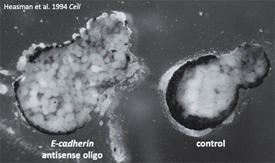

# BI332 Writing Assignment 1

Writing assignments this semester will build towards the production of an experimental proposal of your own design in the style of an [NSF Graduate Research Fellowship Program (GFRP)](https://www.nsfgrfp.org/) proposal. Our first writing assignment will encourage you to think about experimental design and how to describe your plans in writing. 

## Instructions

In class on September 20, we saw the experiment by [Janet Heasman and her coworkers (1994)](https://pubmed.ncbi.nlm.nih.gov/7528101/) that disrupted adhesion of cells in the blastula stage embryo of the frog *Xenopus*, by injection of an anti-sense RNA based on the [*E-cadherin* sequence](https://www.ncbi.nlm.nih.gov/nuccore/U04708.1) into newly fertilized eggs. 

Six different genes encode [“classical” cadherin proteins](https://www.ncbi.nlm.nih.gov/pmc/articles/PMC2773639/) in *Xenopus tropicalis* (E-, N-, M-, P-, R- and T-cadherin). Your  task is to plan one or more experiments to test whether or not the other cadherin proteins are also required for cell adhesion at the [blastula](https://www.youtube.com/watch?v=fUpc93T12bk&t=2s) stage in this species. You may use any methods, classical or current, but they should be feasible and justifiable (see the rubric below).

Write a description of your experimental plan in approximately 150-250 words using a shared Google Doc. Work as a group of two students. (The group may contain 1 or 3 students if approved in advance.) 

The purpose of this assignment is to develop a good experimental plan and to describe it clearly in writing. Therefore it is not necessary to review or cite primary literature in this assignment. (But be aware, that will be required for later assignments.)

This assignment is worth 30 points toward the final course grade. (All members of the group will receive the same grade.)

## Rubric

- **Research Question and Hypothesis (5 points):**

  - Clearly defined research question.
  - A testable hypothesis derived from the research question.

  Score: _______/5

- **Background (4 points):**

  - Provide sufficient information for a typical biologist to understand the context.

  Score: _______/4

- **Experimental Design (5 points):**

  - Clear and detailed description of the experimental design, including variables, controls, and methods.
  - Explanation of the rationale for using the chosen methods.

  Score: _______/5

- **Data Collection and Analysis (4 points):**

  - Explanation of how data will be collected.
  - Explain how the data will be analyzed and interpreted.

  Score: _______/4

- **Significance and Contribution (4 points):**

  - Explanation of the potential significance of the research.
  - Discussion of how the proposed research contributes to the field.

  Score: _______/4

- **Feasibility (3 points):**

  - Demonstration that the proposed research is feasible.

  Score: _______/3

- **Clarity and Organization (5 points):**

  - Ideas are organized and clearly described.
  - Use of standard scientific English and correct terminology.

  Score: _______/5

**Total Score (30 points): _______/30**

### Rating criteria 

For a 5-point rubric item

- **0 Absent**: Fails to include feature or concept that should have been included.
- **1 Poor**: Present, but inadequate, ambiguous, vague or difficult to follow.
- **2 Average**: Meets the basic requirements in this category. No major flaws or critical errors.
- **3 Good**: Items in this category demonstrate good potential, although more detail or other improvements are needed to really be effective.
- **4 Very Good**: Demonstrates a sound grasp of the concepts in this category. Memorable in a positive way.
- **5 Excellent**: Exceptional in this category. Stands out.

---

