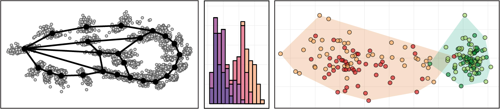

# BI377  Morphometry: The Study of Form

**Colby College  -  Fall 2022  -  Syllabus**

#### Meeting times

Tuesdays 1-4pm, [Olin 019B](https://map.colby.edu/)

#### Instructor

[Dr. David R. Angelini](https://www.colby.edu/directory/profile/dave.angelini/) 

e-mail: [dave.angelini@colby.edu](mailto:dave.angelini@colby.edu)

Office hours: Mondays 12-1pm, Tuesdays 4-5pm, Wednesdays 8-9am

### Prerequisites

[SC212](https://www.colby.edu/catalogue/courses/SC/) Intro to Statistics or instructor authorization

### Learning Objectives

Measurement is central to the practice of science. In many fields, such as biology, objects of study are often dimensionally complex. This course will explore and practice methods for the characterization and comparison of complex forms, which are increasingly applied in graphical rendering, anthropology, medicine, biology and other areas. We will begin with consideration of sampling strategies and simple linear measurements, progressing to topics such as color and shape. This course will present an overview of statistical modeling andits history as applied to the study of shape in biology. Through this course students will (1) learn and implement skills of data science and applied statistical analysis, (2) collaborate with peers on self-directed research projects, (3) practice writing in the context of this field, and (4) learn about the history and societal context of morphometric methods. The course will emphasize coding and problem solving, reading primary literature, group discussion, presentation and writing skills.

### Required text

None.

### Class meetings

This course is intended to be a hands-on exploration of analytical methods. Classes will be a mixture of active lecture, student presentations, and digital / coding activities. Each student will be asked to make brief presentations of the primary literature at least twice during the semester. Because of the interactive nature of this course, attendance and engagement are critical. Please contact me if you anticipate an absence from class. Be aware that classes cannot be missed for an athletic practice. However, if your request is made in advance, I generally allow absences for an athletic contest. Poor attendance will negatively affect your participation grade and may result in an academic warning. During class, please be considerate of other students and make sure that any electronic device is muted. 

This course will raise issues of sexism, racism and colonialism. While this course will focus on biology, the social history of the topic must be acknowledged as we seek to build a more antiracist community. Therefore, it is expected that conversations on these topics, while potentially uncomfortable, will be embraced with respect, compassion and mindful reflection. At any time, if anyone feels that readings, comments in discussion, or structures of the course treat these subjects inappropriately, that critique is welcomed, openly or privately. 

### Digital platforms

This course will make use of several online venues to collaborate. We will also use a custom Rstudio web server for this course.

### Grades

Your final grade for the course will be calculated based on a 1000 point total as listed below. 

| Evaluations                  |      |        |      | Final course grades                  |
| :--------------------------- | ---: | :----- | ---- | :----------------------------------- |
| Participation & Engagement   |   50 | points |      | 900-1000     pts    A (of some kind) |
| Literature presentations (2) |  100 |        |      | 800-899      pts    B (of some kind) |
| Quizzes (5)                  |  200 |        |      | 700-799      pts    C (of some kind) |
| Exercises (10)               |  400 |        |      | 600-699      pts    D (of some kind) |
| Final presentation           |   80 |        |      | 599   pts or below   F               |
| Final written project        |  170 |        |      |                                      |
| total                        | 1000 | points |      |                                      |

### Evaluations

- **Participation** in all discussions is expected. Be ready and willing to share an informed thought during each class. If you are uncomfortable expressing yourself in class, please discuss this with me during office hours. 
- Each class meeting will include a short (5 min) student **presentation** of recent primary literature using methods covered in this course, followed by questions and discussion led by there presenting student. This is opportunity for students to share their own interests and practice presentation.

- Roughly bi-weekly **quizzes** will check students' understanding of fundamental course concepts. 
- Weekly **exercises** will allow students to practice and development skills. These assignments will be a mix of individual and team exercises. Grades for these assignments will be satisfactory, needs improvement, or unsatisfactory. 
- Your **final project** will use the analytical and writing skills we have covered to conduct your own comparative study, or a meta-analysis or re-analysis of published morphometry data. These projects will be conducted in groups, in close consultation with Dr. Angelini. Finished projects will be shared in an online written format and as a presentation to the class.

### Accommodations for public health

Cooperation with the [college’s plan for pandemic response](https://covid19.colby.edu/covid-19-health-and-safety/) is expected. Specific impacts to BI163 may include:

- It may become necessary for the course to transition to a Zoom format at any time.
- Office hours may be held on Zoom. Hours may need to be modified. 
- If you become ill, please follow college policy and inform your advising dean as soon as possible.

### Academic support

If you experience difficulty in this course for any reason, a wide range of services are available from the College to support you.

- First, please speak with me early if you are having trouble in the course. 
- The [Office of the Dean of Students](http://www.colby.edu/administration_cs/student-affairs/deanofstudents/studentconduct/offices_services/dos/) offers services for students with learning differences. If you suspect you have a learning difference that might require accommodations in this course, please inquire with the Dean of Students Office.
- The [Farnham Writing Center](http://web.colby.edu/farnham-writerscenter/) offers support for students on basic writing and reading skills.
- [Counseling Services](http://www.colby.edu/counseling/) (x4460) provided from the Health Center offer professional, confidential consultations regarding family problems, stress, depression, cultural adjustments, concerns with sexuality, alcohol and drug use, trauma and other personal issues.

### Academic honesty 

Honesty, integrity, and personal responsibility are cornerstones of a Colby education and provide the foundation for scholarly inquiry, intellectual discourse, and an open and welcoming campus community. These values are articulated in the Colby Affirmation and are central to this course. Students are expected to demonstrate academic honesty in all aspects of this course. Academic dishonesty includes, but is not limited to: plagiarism (which includes paraphrasing from sources, even with a citation); claiming another’s work or a modification of another’s work as one’s own; buying or attempting to buy papers or other assignments; fabricating information or citations; knowingly assisting others in acts of academic dishonesty; violating clearly stated rules for taking an exam; misrepresentations to faculty within the context of a course; and submitting the same work, including an essay that you wrote, in more than one course. Sanctions for academic dishonesty are assigned by an academic review board and may include failure on the assignment, failure in the course, or suspension or expulsion from the College.

For more information on recognizing and avoiding plagiarism, see these guides:

- [Avoiding Plagiarism](http://libguides.colby.edu/avoidingplagiarism)
- [Academic Honesty](http://web.colby.edu/farnham-writerscenter/academic-honesty/)

### Sustainability 

Environmental degradation is a serious biological and societal issue. [Colby](http://www.colby.edu/administration_cs/green/) is committed to practices that promote sustainable living. To help minimize the environmental impact of this course, I encourage you to buy used books. Minimize paper use by reading slides on a device when possible, rather than printing copies. It is acceptable to take notes on a laptop or tablet during class. If you choose to print, please print double-sided on recycled paper. Multiple slides may be printed to a single sheet. Recycle unnecessary paper after the end of the semester.

### Course Schedule

Be warned: This schedule is subject to continuous revision!

| date    | topic                                         | in-class activity               | quiz | exercise                          | reading                                                      |
| ------- | --------------------------------------------- | ------------------------------- | ---- | --------------------------------- | ------------------------------------------------------------ |
| Sept 13 | Introductions & Overview                      | Intro/Refresher on R & Markdown |      | 1. Markdown                       | Zelditch et al. Ch 1-2                                       |
| Sept 20 | Open science; Hypothesis testing              | Git & GitHub                    |      | 2. GitHub practice                | [O'Dea et al. 2021](https://bmcbiol.biomedcentral.com/articles/10.1186/s12915-021-01006-3); Salsburg Ch TBD |
| Sept 27 | Measurement; Sampling; Descriptive statistics | Sampling, Tests of variance     | 1    | 3. Descriptive statistics         | Kondrashov Ch TBD                                            |
| Oct 4   | Intro to geometric morphometrics; ANOVA       | Digitization, univariate ANOVA  |      | 4. Digitization, univariate ANOVA | [Forstmeier et al. 2016](https://doi.org/10.1111/brv.12315)  |
| Oct 11  | History and social impacts of morphometry     | Data curation                   | 2    | 5. TBD                            | Zimmer Ch TBD                                                |
| Oct 25  | Procrustes alignment                          | Procrustes alignment            | 3    | 6. Procrustes alignment           | Zelditch et al. Ch 3 (pp51, 53-573)                          |
| Nov 1   | Morphospace; Ordination                       | PCA                             |      | 7. PCA                            | Zelditch et al. Ch 3 (p59-60, 62-67, 69-73)                  |
| Nov 8   | Generalized linear modeling                   | Advanced alignment methods      | 4    | 8. GLM                            | Kondrashov Ch TBD                                            |
| Nov 15  | Logistic and beta regression                  | Residual plots                  |      | 9. Analysis of color data         | [Peck et al. 2017](https://doi.org/10.1128/JB.00303-17)      |
| Nov 22  | Modeling in a phylogenetic context            | PIC & PGLS                      | 5    | 10. PGLS                          |                                                              |
| Nov 29  | Writing workshop                              | Work on final projects          |      |                                   |                                                              |
| Dec 6   |                                               | Final presentations             |      | Final project due                 |                                                              |

---

