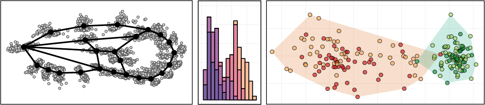

# BI377  Morphometry: The Study of Form

**Colby College  -  Fall 2024  -  Syllabus**

#### Meeting times

Mondays 1-3:30pm, [Gordon 180](https://map.colby.edu/)

#### Instructor

[Dr. David R. Angelini](https://www.colby.edu/directory/profile/dave.angelini/) 

e-mail: [dave.angelini@colby.edu](mailto:dave.angelini@colby.edu)

Office hours: Tuesdays and Wednesdays 3-4pm or by appointment

### Prerequisites

[SC212](https://www.colby.edu/catalogue/courses/SC/) Intro to Statistics or instructor authorization. 

> **Note that this course is not limited to biology majors!** Students in geology, CS, math, stats, anthropology, art, and other majors may find this course interesting and useful. SC212 is required because the course will employ some statistical methods for which a basic knowledge will be helpful. If you are interested in taking BI377, haven't had SC212, but do have a comparable knowledge of statistics please [contact Dr. Angelini](mailto:dave.angelini@colby.edu) for authorization! 

### Learning Objectives

Measurement is central to the practice of science. In many fields, such as biology, objects of study are often dimensionally complex. Through this course students will 

1. learn to apply new skills of data science and statistical analysis,
2. collaborate with peers on self-directed research projects,
3. practice reading and presenting in the context of morphometric analyses, and 
4. learn about and discuss the history and societal context of morphometric methods. 

This course will explore and practice methods for the characterization and comparison of complex forms, which are increasingly applied in graphical rendering, anthropology, medicine, biology and other areas. We will begin with consideration of sampling strategies and simple linear measurements, progressing to topics such as color and shape. This course will present an overview of statistical modeling and its history as applied to the study of shape in biology. The course will emphasize coding and problem solving, reading primary literature, group discussion, and development of presentation skills. 

### Readings

There is no required textbook for this course. Readings will be provided via Moodle.

### Class meetings

This course is intended to be a hands-on exploration of analytical methods. Classes will be a mixture of active lecture, student presentations, and digital / coding activities. Each student will be asked to make brief presentations of the primary literature at least twice during the semester. Because of the interactive nature of this course, attendance and engagement are critical. Please contact me if you anticipate an absence from class. Be aware that classes cannot be missed for an athletic practice. However, if your request is made in advance, I generally allow absences for an athletic contest. Poor attendance will negatively affect your participation grade and may result in an academic warning. During class, please be considerate of other students and make sure that any electronic device is muted. 

This course will raise issues of sexism, racism and colonialism. While this course will focus on natural science, the social history of the topic must be acknowledged as we seek to build a more antiracist community. Therefore, it is expected that conversations on these topics, while potentially uncomfortable, will be embraced with respect, compassion and mindful reflection. At any time, if anyone feels that readings, comments in discussion, or structures of the course treat these subjects inappropriately, that critique is welcomed, openly or privately. 

Class rosters are provided to each instructor with each student's legal name. I will gladly honor your request to address you by an alternate name or gender pronoun. Please advise me of this early in the semester so that I can make appropriate changes to my records. 

### Computational Resources

During this course we will explore the principles of [open data](https://opendatahandbook.org/guide/en/what-is-open-data/) and [open science](https://www.cos.io/about). In that spirit, the [syllabus](https://github.com/aphanotus/openEd/blob/main/BI377.morphometry/BI377.24F.morphometry.syllabus.md) and other static resources are available and updated on [GitHub](https://github.com/aphanotus/openEd/tree/main/BI377.morphometry). Copyrighted materials will be shared using Colby's learning management system, [Moodle](https://moodle.colby.edu/). We will make measurements of photographic data using the free imaging suite [Fiji](https://imagej.net/software/fiji/). Students should be familiar with [Google Sheets](https://workspace.google.com/products/sheets/), where we will share data. We will introduce analytical tools and pipelines in the statistical programming language [R](https://www.r-project.org/), and the course has a dedicated [Rstudio](https://posit.co/products/open-source/rstudio/) server accessible at https://bi377.colby.edu/ (Colby Access or VPN connection required.) To facilitate peer-to-peer collaboration on coding, we will use [Markdown](https://www.markdownguide.org/) via [HackMD](https://hackmd.io/@ColbyBI377/landingpage). Each student will be asked to set-up a free account with [HackMD](https://hackmd.io/). 

### Assessments

Based on our conversations in the first two weeks in this semester, we will adopt an approach know as  **ungrading**. This approach will still assign a letter grade for the course at the end of the semester. However, instead of awarding points for individual assessments throughout the semester, you will build a portfolio of work, consisting of the exercises, quizzes, DataBlitz presentations and the final project. My goal will each assignment will be to provide you with constructive feedback, but you will not receive a numeric or letter grade on individual assignments. I will meet with each of you at least once mid-semester to candidly discuss your progress and again at the end of the semester to discuss the grade you will be assigned. You and I are able to discuss the final grade as something that should reflect your effort and the trajectory of your learning across the semester without *a priori* assumptions. Compared to traditional grading systems, receiving only descriptive feedback in ungrading may lead to some uncertainty about your standing in the course. This system is based on communication, so if you ever feel uncertain, please come and talk with me!

| course assignments                    | number |
| :------------------------------------ | -----: |
| Participation & Engagement            |        |
| Literature presentations (DataBlitzs) |      2 |
| Quizzes                               |      5 |
| Exercises                             |     10 |
| Final presentation                    |      1 |
| Final project                         |      1 |

- **Participation** in all discussions is expected. Be ready and willing to share an informed thought during each class. If you are uncomfortable expressing yourself in class, please discuss this with me during office hours. 
- Most class meetings will include one or more short (5 min) student **presentations** of recent primary literature using methods covered in this course, followed by questions and discussion led by the presenting student. This is opportunity for students to share their own interests and practice presentation.

- Roughly bi-weekly **quizzes** will check students' understanding of fundamental course concepts. 
- Weekly **exercises** will allow students to practice and develop new skills. These assignments will be a mix of individual and team exercises. 
- Your **final project** will use morphometric methods to conduct your own comparative study, or a meta-analysis or re-analysis of published data. These projects will be conducted in small groups of 2-3 students, in close consultation with Dr. Angelini. Finished projects will be presented as posters at the end of the semester.

#### Template for conversations on final grade assignment

While ungrading allows us to focus on course goals without the potential preoccupation with grades on minor assignments, we nevertheless must arrive at a letter grade for the course. Therefore it will be necessary for us to candidly discuss your development towards achievement of the course goals. Such conversations may be unfamiliar or even awkward. The template below is meant to lead us towards a conversation that will help determine an appropriate final grade. 

- Talk about the work you've done this semester in our course, and reflect on the feedback you've received.
- Consider the course learning goals. In which areas do you think we've learned the most or built new skills?
- Reflect on your contribution to the final project. How do you think it represents your strengths and weaknesses?
- Based on this conversation, what final grade do you think you should receive and why? What are the highest and lowest grades that fairly represent your learning in this course?

Ultimately, the goal of this meeting will be to identify a grade we both agree fairly represents your learning.

### Public health

Cooperation with the [college’s plan for pandemic response](https://covid19.colby.edu/covid-19-health-and-safety/) is expected. Specific impacts to this course include:

- If you have any symptoms of respiratory illness, please wear a face mask in class, such as an [N-95](https://www.cdc.gov/coronavirus/2019-ncov/prevent-getting-sick/types-of-masks.html) or similar design.
- If you test positive or experience [symptoms of covid-19](https://www.cdc.gov/coronavirus/2019-ncov/symptoms-testing/symptoms.html), including fever or chills, cough, fatigue and headache, please do not attend class in person.
- In the case of a covid case surge, it may become necessary for the course to transition to a Zoom format. In which case, changes to the syllabus may be necessary.
- Office hours may be held on Zoom; hours may need to be modified.
- This policy may be modified as public health conditions change.

### Sustainability 

Environmental degradation is a serious biological and societal issue. [Colby](http://www.colby.edu/administration_cs/green/) is committed to practices that promote sustainable living. To help minimize the environmental impact of this course, I encourage you to buy used books. Minimize paper use by reading slides on a device when possible, rather than printing copies. It is acceptable to take notes on a laptop or tablet during class. If you choose to print, please print double-sided on recycled paper. Multiple slides may be printed to a single sheet. Recycle unnecessary paper after the end of the semester.

### Access and Support

First, please speak with me early if you are having trouble in the course.

- [Counseling Services](http://www.colby.edu/counseling/) (207-859-4490) provided from the Health Center offer professional, confidential consultations regarding family problems, stress, depression, cultural adjustments, concerns with sexuality, alcohol and drug use, trauma and other personal issues.
- [Class Deans](mailto:deanofstudies@colby.edu) can guide students through a range of issues. Students can reach out to their class dean via email or by calling x4560. They are also welcome to visit the Dean of Studies Office in Eustis 107 for assistance with scheduling or other inquiries. 
- If you encounter barriers to your full participation in this course, please let me know immediately so we can determine if there is an accommodation that can be made. If you are a student with a disability, or think you may have a disability, the [Dean of Students Office](https://www.colby.edu/studentadvising/student-access-and-disability-services/) works with students and faculty to identify reasonable accommodations. 
- The [Farnham Writing Center](http://web.colby.edu/farnham-writerscenter/) offers support for students on basic writing and reading skills.
- [DavisConnects](https://davisconnects.colby.edu/) helps students  explore internship, career, and study abroad opportunities. Make [an appointment](https://colby.joinhandshake.com/login) with an advisor through the Handshake portal.

### Academic Integrity 

Honesty, integrity, and personal responsibility are cornerstones of a Colby education and provide the foundation for scholarly inquiry, intellectual discourse, and an open and welcoming campus community. These values are articulated in the Colby Affirmation and are central to this course. You are expected to demonstrate academic honesty in all aspects of this course. Academic dishonesty includes, but is not limited to: plagiarism (which includes paraphrasing from sources, even with a citation); claiming another’s work or a modification of another’s work as one’s own; buying or attempting to buy papers or other assignments; fabricating information or citations; knowingly assisting others in acts of academic dishonesty; violating clearly stated rules for taking an exam; misrepresentations to faculty within the context of a course; and submitting the same work, including an essay that you wrote, in more than one course. Sanctions for academic dishonesty are assigned by an academic review board and may include failure on the assignment, failure in the course, or suspension or expulsion from the College.

For more information on recognizing and avoiding plagiarism, see these guides:

- [Avoiding Plagiarism](http://libguides.colby.edu/avoidingplagiarism)
- [Academic Honesty](http://web.colby.edu/farnham-writerscenter/academic-honesty/)

### Sexual Misconduct

Colby College prohibits [sexual misconduct or gender based discrimination](http://www.colby.edu/studentlife/handbook-section/f-sexualmisconduct/) and is obligated, by federal and state laws, to respond to reports and provide resources to students. As your professor I am considered a "responsible employee" which requires me to report incidence of sexual assault, sexual harassment, dating violence, or stalking to the[ Title IX Coordinator](https://www.colby.edu/directory/?sq=Meg Hatch). 

If you wish to access confidential support services, you may contact: 

- [Counseling Services](http://www.colby.edu/counseling/) (207-859-4490) 
- [Title IX Confidential Advocate](https://life.colby.edu/your-safety/sexual-violence-title-ix/meet-the-staff/) (207-509-9122) 
- [Office of Religious and Spiritual Life](https://life.colby.edu/what-to-do/spiritual-life/) (207-859-4272 )
- [Maine Coalition Against Sexual Assault](https://www.mecasa.org/) (24/7 helpline: 1-800-871-7741)

### Course Schedule

| date | quiz | topic of the day | reading | in-class activity | exercise 1 |
|:---- |:----:|:---- |:---- |:---- |:---- |
| Sept 9 |  | Introductions & Overview |  | Markdown; Refresher on R | 1. Markdown & R |
| Sept 16 | 1 | Open science; Measurement; Hypothesis testing | [O'Dea et al. 2021](https://bmcbiol.biomedcentral.com/articles/10.1186/s12915-021-01006-3); [Ross-Hellauer 2022](https://www.nature.com/articles/d41586-022-00724-0); Nguyen 2021 ([abstract](https://onlinelibrary.wiley.com/doi/abs/10.1111/phpr.12823) or [video](https://www.youtube.com/watch?v=8JEzXL5OXPI)); [Heard 2023](https://scientistseessquirrel.wordpress.com/2023/11/14/the-case-against-open-data/); Kondrashov 2016 (p9-25, 60-69, 75-100) | Distributions; Sampling; Tests of variance | 2. Descriptive statistics, hypothesis testing |
| Sept 23 |  | Sampling; ANOVA | [Forstmeier et al. 2016](https://doi.org/10.1111/brv.12315); [Numbers around us 2024](https://medium.com/number-around-us/guarding-against-misleading-data-503424ecd457) | Data curation; univariate ANOVA | 3. Data curation; univariate ANOVA |
| Sept 30 | 2 | Intro to geometric morphometrics | Zelditch et al. 2012 (p1-17, 23-35) | Landmark-based digitization | 4. Anatomical digitization |
| Oct 7 |  | Procrustes alignment | Zelditch et al. 2012 (p51, 53-57) | GPA | 5. GPA |
| Oct 21 | 3 | Morphospace; Ordination | Zelditch et al. 2012 (p59-60, 62-67, 69-73, 75-102) | PCA | 6. PCA |
| Oct 28 |  | Generalized linear modeling | Kondrashov 2016 (p 177-196) | [Tree thinking](https://www.science.org/doi/10.1126/science.1117727) | 7. GLM |
| Nov 4 | 4 | Phylogenetic context | Revell & Harmon 2022; Symonds & Blomberg 2014 | PIC; PGLS | 8. PGLS |
| Nov 11 |  | Colorimetry; Residual plots | [Peck et al. 2017](https://doi.org/10.1128/JB.00303-17) Suppl.; [Weller & Westneat 2019](https://peerj.com/articles/6398/) |  | 9. Planning final projects |
| Nov 18 | 5 | History and social impacts | Terhune et al. 2018; Zhang et al. 2022 | Work on final projects | 10. Data-gathering |
| Dec 2 |  | Final presentations |  | Final presentations | Final project due |

1 complete before next class

---

