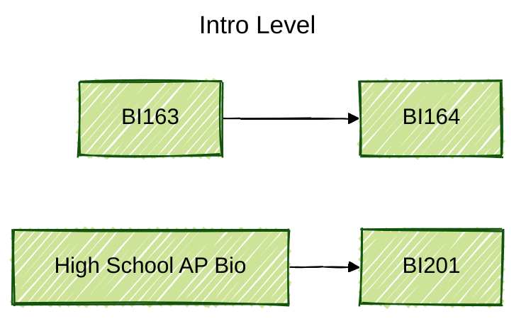
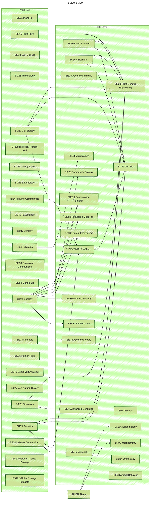
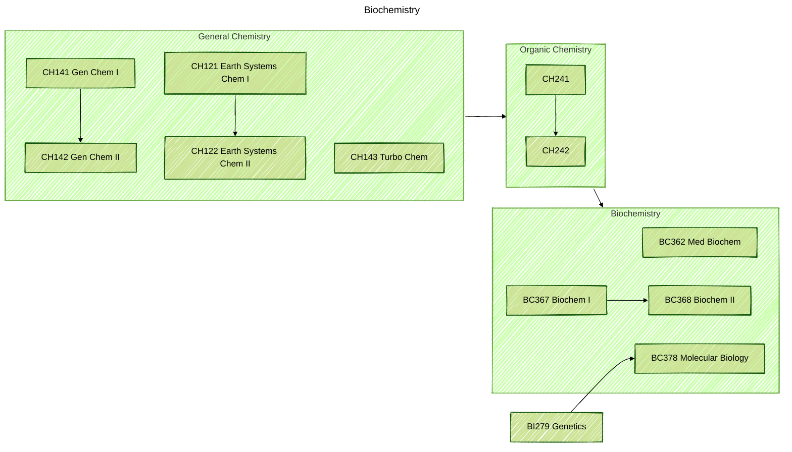

# Biology Curriculum Map

```mermaid
---
title: Intro Level
config:
  look: handDrawn
  theme: forest
---
flowchart LR
  BI163 --> BI164
  AP["High School AP Bio"] --> BI201
```

```mermaid
---
title: BI200-BI300
config:
  look: handDrawn
  theme: forest
---
flowchart LR
  subgraph level200["200 Level"]
    BI211["BI211 Plant Tax"]
    BI215["BI215 Plant Phys"]
    BI218["BI218 Evol Cell Bio"]
    BI225["BI225 Immunology"]
    BI227["BI227 Cell Biology"]
    ST228["ST228 Historical Human A&P"]
    BI237["BI237 Woody Plants"]
    BI241["BI241 Entomology"]
    BI244["BI244 Marine Communities"]
    BI246["BI246 Parasitology"]
    BI247["BI247 Virology"]
    BI248["BI248 Microbio"]
    BI253["BI253 Ecological Communities"]
    BI254["BI254 Marine Bio"]
    BI271["BI271 Ecology"]
    BI274["BI274 Neurobio"]
    BI275["BI275 Human Phys"]
    BI276["BI276 Comp Vert Anatomy"]
    BI277["BI277 Vert Natural History"]
    BI278["BI278 Genomics"]
    BI279["BI279 Genetics"]
    ES244["ES244 Marine Communities"]
    ES276["ES276 Global Change Ecology"]
    ES282["ES282 Global Change Impacts"]        
  end
  SC212["SC212 Stats"] --> SC306
  SC212 --> BI377
  subgraph level300["300 Level"]
        BI271 --> ES319["ES319 Conservation Biology"]
        BI320["Evol Analysis"]
        BI215 --> BI323["BI323 Plant Genetic Engineering"]
        BI227 --> BI323
        BI278 --> BI323
        BI279 --> BI323
        BC362["BC362 Med Biochem"] --> BI323
        BC367["BC367 Biochem I"] --> BI323
        BI225 --> BI325["BI325 Advanced Immuno"]
        BI271 --> BI328["BI328 Community Ecology"]
        BI227 --> BI332["BI332 Dev Bio"]
        BI279 --> BI332
        BI347 --> BI332
        BC362 --> BI332
        BC367 --> BI332
        BI334["BI334 Ornithology"]
        BI248 --> BI344["BI344 Microbiomes"]
        BI278 --> BI345["BI345 Advanced Genomics"]
        BI227 --> BI347["BI347 MBL JanPlan"]
        BI279 --> BI347
        BI373["BI373 Animal Behavior"]
        BI274 --> BI374["BI374 Advanced Neuro"]
        BI279 --> BI376["BI376 EvoDevo"]
        BI377["BI377 Morphometry"]
        BI271 --> BI382["BI382 Population Modeling"]
        BI271 --> ES319["ES319 Conservation Biology"]
        BI271 --> ES338["ES338 Forest Ecosystems"]
        BI271 --> ES356["ES356 Aquatic Ecology"]
        SC306["SC306 Epidemiology"]
        BI271 --> ES494["ES494 ES Research"]
  end

```

```mermaid
---
title: Biochemistry
config:
  look: handDrawn
  theme: forest
---
flowchart LR
  subgraph Intro["General Chemistry"]
    CH141["CH141 Gen Chem I"] --> CH142["CH142 Gen Chem II"]
    CH143["CH143 Turbo Chem"]
    CH121["CH121 Earth Systems Chem I"] --> CH122["CH122 Earth Systems Chem II"]
  end
  subgraph Orgo["Organic Chemistry"]
    CH241 --> CH242
  end
  Intro --> Orgo
  BI279["BI279 Genetics"]
  subgraph Biochem["Biochemistry"]
    BC362["BC362 Med Biochem"]
    BC367["BC367 Biochem I"] --> BC368["BC368 Biochem II"]
    BC378["BC378 Molecular Biology"]
  end
  Orgo --> Biochem
  BI279 --> BC378

```

